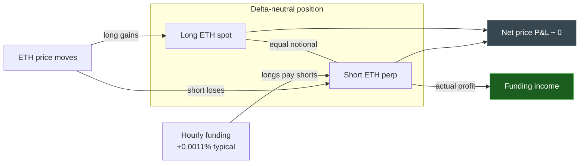
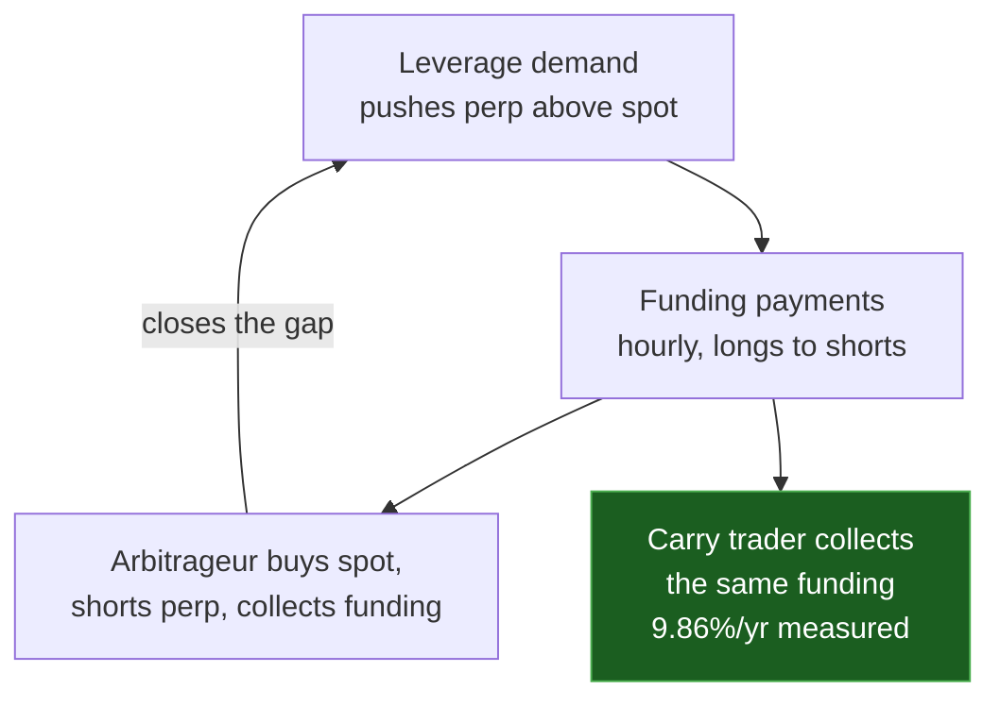
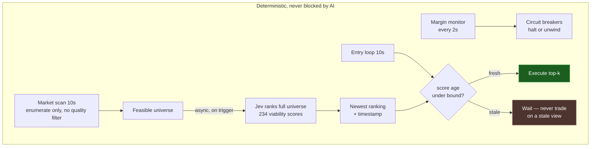
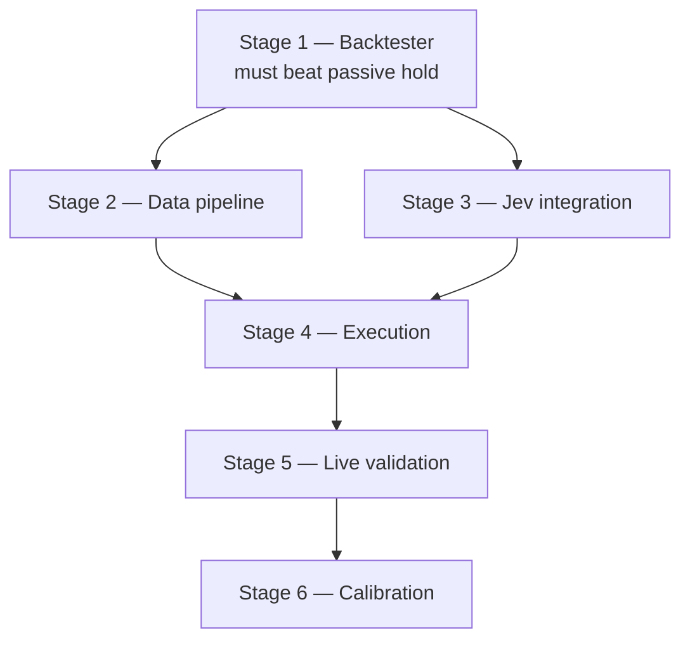

# Funding Rate Harvesting (Hyperliquid)

Delta-neutral funding carry agent. Technical detail: [`docs/FUNDING-HARVEST-SPEC.md`](../../../../docs/FUNDING-HARVEST-SPEC.md).

## The strategy

Perp futures trade at a small premium to spot. That premium is paid out hourly between long
and short holders — **longs pay shorts when funding is positive.** Arbitrageurs keep the two
prices pinned by buying spot and shorting perp, and they get paid for it. A carry trader
takes the other side of that payment.

The agent's position is long spot and short perp, equal size. Price moves on the two legs
cancel. What remains is the funding.

The premium exists because leverage buyers push perp above spot:

## What is actually at risk

Price risk is hedged away. Three things are not:

| Risk | Effect |
|---|---|
| **Funding flips negative** | A short perp position *pays* out. Measured min was −1.73e-5/h. |
| **Costs** | 30 bps round trip. At mean funding that needs **~267 hours (~11 days)** of holding to recover. |
| **Margin** | The short leg can be liquidated before funding arrives. |

That middle row drives the whole design: **this is a low-frequency strategy wearing a
high-frequency costume.** An agent that churns daily loses money on costs alone. Holding
time is the dominant variable, which is why Jev must predict duration and not just
direction.

Return on *capital* is also below the headline rate. Funding accrues on perp notional, but
capital is spot notional plus margin, so at 2–3× leverage the realised rate is
`f / (1 + 1/L)` ≈ **6.6–7.4%/yr** against the 9.86% raw rate. Benchmarks must be compared
like for like.

## Decision architecture

**Code enumerates opportunities. Jev judges them. Code never judges quality.**

Code applies only capital and data-integrity constraints — margin available, position cap,
leverage ≤3×, live spread, staleness, venue health. Those are not judgments about whether a
trade is good. It applies no percentile, z-score, persistence, or volatility threshold. Any
such filter would be selecting on attractiveness, which is Jev's job.

That distinction is load-bearing. If code picks which markets matter, the score is never
tested on anything difficult, and "flat calibration means remove Jev" becomes a guaranteed
outcome rather than a test.

Jev returns a continuous **viability score** for every enumerated market, not `ENTER/SKIP`.
That ranks the universe, buckets properly for ECE/Brier, and produces a calibration point
for every scan — including the markets not taken.

Jev's scan is **off the critical path**. Scoring 234 markets means emitting ~700 numbers —
about 3.5s at a realistic decode rate, so subsecond across the full universe is not
available at any model size worth trusting. The entry loop instead reads the freshest
ranking and acts only while it is under `MAX_SCORE_AGE_S`.

That staleness bound is not a quality judgment. It is "do not trade on a stale price" applied
to the model's view: a stale ranking is not a bearish ranking, it is no ranking at all. When a
scan fails, the previous ranking ages out and entries stop — uncertainty closes the position.

## Venue constraints

Read from `https://api.hyperliquid.xyz/info`, 2026-10-05. Hyperliquid is **not EVM** —
`viem` cannot reach it; the official SDK is the only client.

- 234 perp markets. ETH `szDecimals` 4. Exchange permits 25× leverage; we use 2–3×.
- Funding accrues **hourly**.
- **`fundingHistory` hard-caps at 500 points and silently truncates.** A 30-day request
  returned only Sept 5–26. History must be paginated (~18 calls/year).
- 90-day z-score windows need a warm cache — unavailable at cold start.

## Hard constraints

1. **Jev gates entries only.** Exits, rebalancing, and all circuit breakers are code.
2. **Cadences stay asymmetric:** margin monitor 2 s, market scan 10 s, Jev async on
   trigger. The Jev scan is never awaited by the entry loop.
3. **Jev failures fail closed.** No scan → the ranking ages out → no entry. Never a
   fabricated ranking or a permissive default.
4. **Code never filters on attractiveness.** Capital and data-integrity constraints only.
5. **The UI shows only active strategies, and never synthetic data.** No mock rows, no
   fabricated judgement, and no mode label that does not match reality. An empty dashboard
   that says "no active strategy" is correct; a populated one showing invented numbers is
   worse than useless.
6. **Backtest liquidation against candle high/low, not close.** Zero simulated liquidations
   is a hard gate.
7. **Leverage 2–3×**, never the 25× the exchange permits. Leverage is *derived* from the
   notional the caps allow, never chosen directly (§3.6).
8. **The model cannot propose position size.** Sizing is code; the cap lives below the model
   in the stack.

## Acceptance criteria

Stage 1 gates the rest. Stages 2 and 3 proceed in parallel once it passes, and all three
converge on Stage 4:

### Stage 1 — Backtester (must land before any execution code)

- [ ] **Pagination loop (§6.6)** with all five contiguity assertions as tests
- [ ] **History persistence (§6.5)** — schema, gap-fill on restart, cold-start refusal
      below `MIN_FEASIBLE_MARKETS`
- [ ] Paginated `fundingHistory`, ≥12 months, verified point counts per page
- [ ] OHLCV at 1m for ETH and SOL
- [ ] Carry simulator accruing funding at exact interval timestamps, not averaged
- [ ] **Intrabar liquidation check against candle high/low**
- [ ] Fee + slippage model (taker both legs, 10 bps entry/exit, 25 bps rebalance)
- [ ] **Sizing policy (§3.6)** — volatility scalar, notional caps, leverage derived not
      chosen, both entry gates
- [ ] **Policy variants compared out-of-sample** against fixed 2× and fixed 3×. If the full
      policy does not beat fixed-2× after costs, the volatility scalar and viability filter
      are unjustified and get deleted
- [ ] **Beats passive delta-neutral hold on net ROI**
- [ ] **≥200 simulated trades, 0 simulated liquidations**

### Stage 2 — Live data pipeline (no order capability in code)

- [ ] Funding poller with staleness limits; failed fetch returns `null`, never a stale value
- [ ] Warm 90-day cache; survives restart without recomputing
- [ ] 2 s margin monitor, independent of the AI provider
- [ ] Spot/perp price reconciliation, 50 bps divergence alarm
- [ ] Full JSONL decision logging
- [ ] 7 consecutive days without unhandled errors

### Stage 3 — Jev integration

- [ ] OpenRouter client, `response_format: json_object`, temperature 0.1
- [ ] Viability score required for **every** enumerated market, shortlist validated against
      what was actually sent — a hallucinated symbol must never reach sizing
- [ ] **Fail-closed on every error path** — no default ranking is ever fabricated
- [ ] `duration_hours`, `roi_pct`, `invalidators` persisted; score for all markets logged
- [ ] Overlapping scans impossible (`scanInFlight` guard) so a slow model cannot exhaust the
      rate limit
- [ ] Inference cost instrumentation: tokens in/out, cost per scan, daily cumulative

### Stage 4 — Execution

- [ ] Both legs simulated **before** either live order
- [ ] Dual-leg-failure recovery: retry hedge, then **unwind spot** rather than sit naked
- [ ] All circuit breakers armed from the first trade
- [ ] Stress ladder (5/10/20/35% shock) gates every entry
- [ ] Position limit $5,000, one position, ETH only
- [ ] Manual daily reconciliation

### Stage 5 — Live validation

- [ ] ≥20 completed live positions
- [ ] Realized ROI within ±30% of backtest
- [ ] Zero unresolved leg-failure incidents

### Stage 6 — Calibration

- [ ] ≥100 live positions
- [ ] ECE < 0.10, Brier < 0.21
- [ ] Confidence buckets strictly monotonic
- [ ] Duration MAPE < 40%

## Out of scope

Multi-exchange arbitrage, order book modelling, market making, HFT, cross-collateral
optimization, governance, multi-venue support before calibration.

## Success

Confidence is informative **and** net ROI beats passive hold after all costs. Not "it made
money" — that could be a favourable regime. Not "it ran without errors" — a bot that
faithfully loses has failed.

If the calibration curve is flat after 200 trades, Jev is decoration and the correct action
is to remove it for a z-score threshold rule. That is a valid outcome.

## Failure — stop and reassess

- Backtest net ROI below passive hold → no edge, do not proceed
- Any simulated liquidation → sizing is wrong
- Live ROI outside ±30% of backtest → the backtest is not modelling reality
- Flat calibration after 200 trades → remove Jev, keep the threshold rule