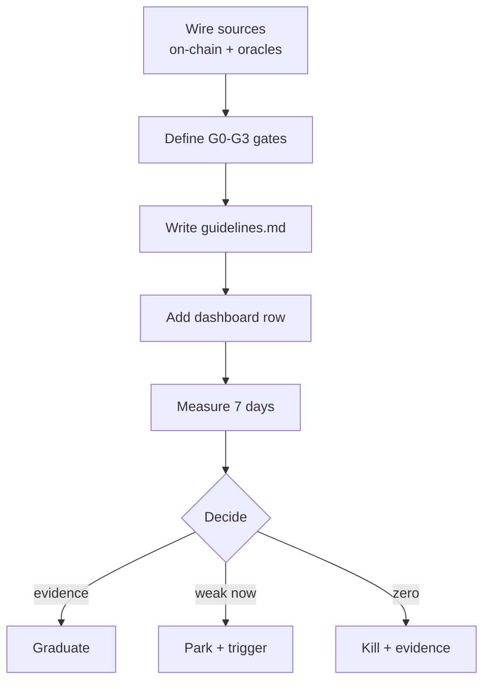

# Plan: 005 Opportunity Discovery Radar

Work proceeds strictly one strategy at a time (spec §b). Phase order below is the
build order; Phase 4 loops per strategy in queue order (S1–S4, N4, N1, N2, N5, N3, N6).

## Per-strategy loop (repeated in Phase 4)

## Phase 0 — Queue + schema

- [ ] Confirm strategy queue order in spec; record any reorder with reason
- [ ] Define JSONL paper-log schema
  (`strategy, chain, block, candidate_id, size_usd, source, gate, gate_reason, annotations`)
- [ ] Log directory convention (`data/radar/<strategy>.jsonl`)

## Phase 1 — Sources + gates (spec §a, §c)

- [ ] `src/radar/sources.ts` — on-chain + near-RT oracle adapters with TTLs;
  pointer-API rows tagged, re-verified on-chain before G0
- [ ] `src/radar/gates.ts` — shared G0 freshness / G1 integrity / G2 economics /
  G3 dedupe framework (pure functions + reason strings)
- [ ] `src/radar/runner.ts` — `npm run radar -- <strategy>`; refuses a second
  concurrent run with the active strategy name
- [ ] S1 + S2 piggyback logging in the live scan loop (cached reads, zero extra RPC)

## Phase 2 — Jev guidelines (spec §d)

- [ ] Guideline-block format + first `guidelines.md` (S1): judge / don't-judge,
  reasoning codes, 0.55 threshold, `JEV_MIN_INTERVAL_MS` throttle
- [ ] Survivor-only wiring: G0–G3 pass → batched Jev call → verdict log
  (guideline version + gate facts per verdict)
- [ ] Ground-truth scoring query (verdict vs later outcome per strategy)

## Phase 3 — Dashboard (spec §e)

- [ ] `/api/status` radar state: per-strategy state, funnel counts, top opp, updated-at
- [ ] Simple-view Radar panel: one row per strategy, existing tab/funnel/table
  conventions; stale rule (updated-at older than cadence shows `stale`)
- [ ] Facts-only review pass: every number sourced + timestamped, no adjectives

## Phase 4 — Prospect the queue (one at a time; kill notes count as done)

- [ ] S1 raw-seize distribution (pre-gate sizes by collateral family × chain)
- [ ] S2 wave clustering (size/timing per market)
- [ ] S3 spread persistence (net of fees)
- [ ] S4 dust steady-state (sub-threshold leftovers)
- [ ] N4 oracle-lag lead time (spread-widening vs HF-cross)
- [ ] N1 first new protocol (raw count/size vs Morpho)
- [ ] N2 discount frequency (>$10K depth, >2% vs redemption)
- [ ] N5 claimable cadence (rewards/auctions vs gas)
- [ ] N3 paper triangles (quotes-positive loops net of gas, sampled)
- [ ] N6 auction/redemption fills (frequency × discount depth)

## Phase 5 — Ranking + graduation

- [ ] Ranked table (frequency × median size × data confidence) with log pointers
- [ ] Graduate / Park (trigger + date) / Kill (evidence) per strategy
- [ ] Graduate proposal(s) as new backlog track(s), realizability gates restored
