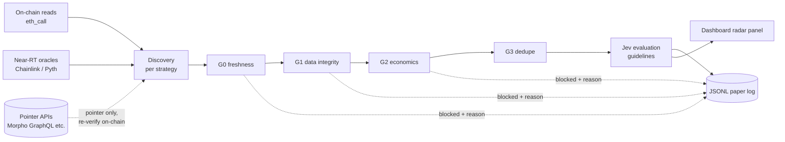
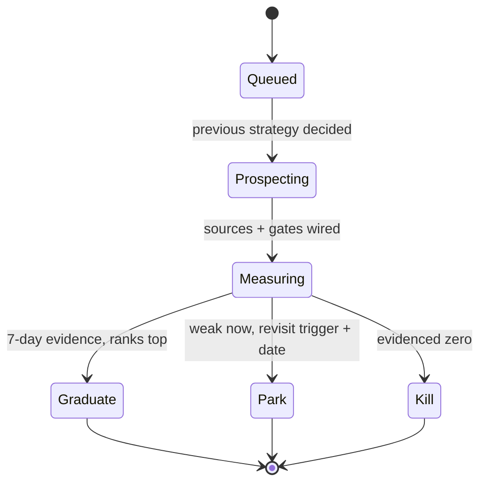

# 005 Opportunity Discovery Radar — Spec

## Objectives

| # | Objective | Where it lands |
|---|---|---|
| a | Discovery uses on-chain or near-real-time oracle sources | Sources, pipeline |
| b | One DeFi strategy at a time | Lifecycle, plan |
| c | Procedural gates evaluate each discovered opportunity | Gates |
| d | Passing opps run through Jev with evaluation guidelines | Jev guidelines |
| e | Dashboard always shows status, easy to understand, facts only | Dashboard |

## Pipeline

Every rejection is logged with its gate and reason. Nothing disappears silently.

## Strategy lifecycle (one at a time)

Max one strategy in `Prospecting`/`Measuring`. A strategy leaves the loop only via
Graduate / Park / Kill. The queue order lives in this spec (Strategy queue).

---

## a) Sources — on-chain or near-real-time oracles

1. **On-chain reads are the authority.** `eth_call` against protocol contracts,
   DEX factories/pools, oracle `price()` / `latestRoundData()`. Reuses
   `src/lib/prices.ts`, `src/lib/morpho.ts`.
2. **Near-real-time oracles second.** Chainlink `latestRoundData` (with `updatedAt`
   age check), Pyth pull prices. A quote without a timestamp is not a source.
3. **Off-chain APIs are pointers only.** Morpho GraphQL, subgraphs, REST lists may
   *nominate* candidates; each nominee is re-verified on-chain before G0. API-only
   rows never reach gates or Jev.
4. **Freshness TTLs per source class** (override per strategy, defaults):
   on-chain 1 block, Chainlink/Pyth 120s, pointer API 300s. Stale = G0 block.
5. **Rate-limit discipline.** Public RPC + 750 req/min Morpho API cap; cache with
   TTL, piggyback the live scan loop where possible.

## b) One strategy at a time

1. The radar works the Strategy queue **strictly in order**, one active prospect.
2. Starting the next strategy requires the current one to be **decided**
   (Graduate / Park / Kill with its 7-day log or kill note).
3. Reordering the queue is allowed; parallel prospecting is not.
4. Each strategy gets the same loop: wire sources → define gates → define Jev
   guidelines → dashboard row → 7-day log → decide (plan Phase 4).

## c) Procedural gates — code evaluates every opportunity

Gates are deterministic, ordered, and logged. They judge **data and economics only —
never executability** (thin liquidity, missing flash venue, cross-chain friction are
annotations, decided at graduation).

| Gate | Checks | Block examples |
|---|---|---|
| G0 freshness | source timestamps within TTL; block number known | oracle age > TTL, API-only row |
| G1 data integrity | no zero/absurd values; oracle exists; collateral not on strategy deny-list | seize $0, dex/oracle ratio absurd, ghost collateral (USR/RSS/RLP…) |
| G2 economics | size ≥ `MIN_OPP_USD`; edge (spread/discount/profit proxy) > gas + slippage + fee | dust, spread < cost |
| G3 dedupe | identity key `(strategy, chain, market, user)`; one row per identity | repeat sightings bump count, not rows |

- Gate code lives per strategy under `src/radar/<strategy>/gates.ts`, sharing
  helpers with `src/lib/gates.ts` style (pure functions, reason strings).
- Every block records `gate + reason`; the dashboard funnel shows counts per gate.

## d) Jev evaluation — guidelines, survivors only

Only G0–G3 survivors reach Jev (mirrors `docs/system-one-redesign.md`:
System Two excludes, System One ranks/flags among survivors).

1. **Per-strategy guideline block**, stored with the strategy (`guidelines.md`):
   what Jev judges (e.g. wave timing, discount persistence, competition pressure),
   what it must NOT judge (no arithmetic, no authorization, no veto without a
   reasoning code).
2. **Reasoning codes per strategy**, same contract style as `src/jev/client.ts`
   (`action, confidence, reasoningCode, priority`); codes must name checkable claims.
3. **Thresholds:** confidence ≥ 0.55 to count as pass; below = recorded, not passed.
4. **Cost throttle:** batched calls under the existing `JEV_MIN_INTERVAL_MS`;
   idle cycles ask at most one batched question.
5. **Falsifiable:** each verdict logs guideline version + gate facts, scored later
   against ground truth (did the wave arrive? did the discount persist?).

## e) Dashboard — status in plain facts

Extends the existing `/api/status` + Simple view (`src/server.ts`, `public/index.html`);
same tabs/funnel/table conventions, new **Radar** panel. Facts only: numbers with
sources and timestamps — no adjectives, no unlabeled projections.

Radar panel, one row per strategy:

| Field | Example |
|---|---|
| Strategy | S2 wave-watch |
| State | measuring (day 3/7) |
| Funnel | found 412 → G1 388 → G2 41 → Jev 12 → pass 3 |
| Top opp | $18.2K seize, ethereum, block 24180311, 4 min ago |
| Updated | 12:01:44 UTC |

Rules: row updates every cycle the strategy runs; `Updated` never older than the
strategy's cadence without showing `stale`; Park/Kill rows collapse to one line
with the decision + log pointer.

---

## Strategy queue (in order)

### Existing (measure before judging)

- **S1 — Morpho Blue liquidation racing (current).** Baseline: ~1,690 candidates/cycle,
  0 survive exit-liquidity. Question: largest raw seize by collateral family × chain —
  is the gate or the venue the problem?
- **S2 — At-risk wave watch (HF 0.98–1.30).** Question: do waves arrive in predictable
  clusters? Log wave size/timing per market.
- **S3 — Recursive leverage / rate spread.** Question: which markets sustain
  borrow-vs-staking spreads net of fees over 7 days?
- **S4 — Bad-debt / dust cleanup.** Question: steady-state set of sub-threshold
  positions keepers leave behind?

### New (prospect from zero, cheapest reads first)

- **N1 — Multi-protocol liquidation scan.** Aave V3, Compound Comet, Spark, Moonwell,
  Euler v2, Silo — one at a time, largest-TVL unscanned venue first. Question: raw
  liquidatable count/size vs Morpho.
- **N2 — Depeg / discount capture.** DEX spot vs oracle/redemption. Question: frequency
  and depth of >2% discounts on >$10K depth.
- **N3 — DEX triangular / multi-hop arb (paper).** Quote loops on known factories.
  Question: quotes-positive loop frequency net of gas, sampled.
- **N4 — Oracle-lag wave prediction.** Spread-widening vs HF-cross lead-time distribution.
- **N5 — Incentive / rewards harvest.** Claimable-value cadence vs gas on chains read already.
- **N6 — Redemption / auction discounts.** Fill frequency × discount depth.

Out of scope: MEV sandwiching, CEX-dependent basis/funding, anything needing new
private infra before its first paper log.

---

## Acceptance Criteria

### Stage 1 — Source + gate harness

- [ ] On-chain/near-RT source adapters with TTLs (`src/radar/sources.ts`); pointer-API
  rows tagged and re-verified before G0
- [ ] Shared gate framework G0–G3 (`src/radar/gates.ts`) + JSONL paper-log schema
  (`strategy, chain, block, candidate_id, size_usd, source, gate, gate_reason, annotations`)
- [ ] `npm run radar -- <strategy>`: runs one strategy, one at a time (second
  concurrent run refuses with the active strategy name)

### Stage 2 — Jev guidelines

- [ ] Guideline-block format + per-strategy `guidelines.md` (judge / don't-judge,
  reasoning codes, 0.55 threshold, throttle)
- [ ] Verdict logging with guideline version + gate facts; ground-truth scoring query

### Stage 3 — Dashboard

- [ ] Radar panel in Simple view: one row per strategy (state, funnel, top opp, updated)
  following existing tab/funnel/table conventions; stale rule enforced
- [ ] Facts-only review: every number has source + timestamp, no adjectives

### Stage 4 — Prospect the queue (S1–S4, N4, N1, N2, N5, N3, N6)

- [ ] Each strategy: 7-day paper log OR kill note (what read blocked it)
- [ ] Kill notes are first-class output — a fast evidenced "no" beats an unmeasured "maybe"

### Stage 5 — Ranking + graduation

- [ ] Ranked table: frequency × median size × data confidence, with log pointers
- [ ] Each strategy ends Graduate (new track proposal) / Park (trigger + date) / Kill (evidence)
- [ ] "Measured nothing" is failure; "measured zero" is success

---

## Data Pipeline

| Source class | Method | Cadence |
|---|---|---|
| On-chain state | `eth_call` via `src/lib/prices.ts` / `morpho.ts`, TTL-cached | per strategy need |
| Near-RT oracles | Chainlink `latestRoundData`, Pyth pulls, age-checked | per quote |
| Pointer APIs | Morpho GraphQL (`src/scan.ts`), protocol subgraphs | piggyback loop / daily batch |
| DEX quotes (N3) | factory `getPool` + slot/liquidity reads | sampled, not per-block |

---

## Success Gate

**Ranked table + graduation decisions from 7-day paper evidence, with the dashboard
showing every strategy's live funnel in facts.** No strategy moves toward capital on
narrative; the graduating track re-imposes realizability gates.
