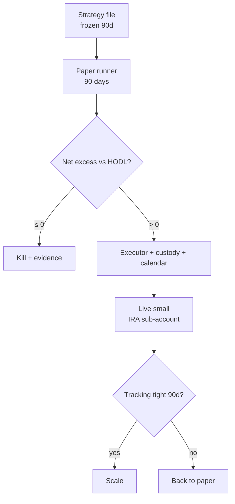

# Plan: 006 Equity Index Sleeve

Build order is the lifecycle order (spec): paper → decide → executor → live-small →
scale. No phase starts before its gate. One strategy at a time per repo workflow;
this track waits behind 004/005.

## Phase 0 — Strategy file (pre-registration)

- [ ] Universe cutoffs (volume, spread, fund size for ETF wrappers) with values
- [ ] Weight math (sqrt-cap, tilt bounds, trim rule, caps, cash band)
- [ ] Bands, cost bar, drawdown rule, context caps — all numeric, all frozen
- [ ] Benchmark definitions (HODL basket construction, Stoic proxy source)
- [ ] Commit frozen file; any edit restarts the 90-day clock

## Phase 1 — Paper runner (zero new infra)

- [ ] Ranking + band math script (free public APIs: quotes + history)
- [ ] Fill logger → `data/paper/006-equity-index.jsonl`
  (ticker, date, signal px, fill px, friction, rule citation)
- [ ] HODL-basket tracker + Stoic-proxy tracker over the same window
- [ ] Dashboard paper panel (index vs HODL, rebalance log, friction ledger)

## Phase 2 — Decide

- [ ] Net excess vs HODL after fees + estimated tax: Pass or Kill
- [ ] Kill → evidence summary, track to `closed/`; Pass → Phase 3 approved

## Phase 3 — Executor + custody (only on Pass)

- [ ] Broker order-state machine (place/ack/fill/partial/cancel/reject, T+1 aware)
- [ ] Session calendar (hours, halts, splits/dividends)
- [ ] Custody: sub-account, scoped keys, spend caps, killswitch
- [ ] Live legs on dashboard + optionality row (`exit-2` tripwire)

## Phase 4 — Live small

- [ ] IRA sub-account funded at insurance-plus size; scoped key live
- [ ] $1 path test + cancel drill green before first real leg
- [ ] 90-day tracking error paper-vs-live; tight → Scale, wide → BackToPaper
