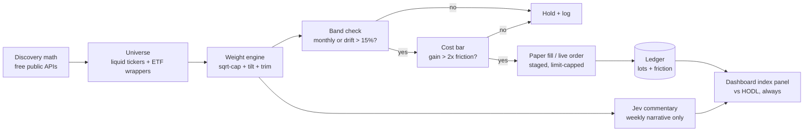

# 006 Equity Index Sleeve — Spec

## Strategy

**Stoic-style systematic equity index on Robinhood rails, paper-first.**

- **Venue:** Robinhood equities/ETFs for execution (crypto exposure via ETF wrappers,
  never spot rotation); free public APIs for discovery math; this app for measurement.
- **Method:** rules allocate, Jev narrates. Cap-weighted base + momentum tilt + topping
  trim, monthly cadence or ±15% drift bands, per-trade cost bar.
- **Capital:** live only in an IRA sub-account (rotation is short-term-gains toxic in
  taxable); dedicated sub-account, scoped keys, spend cap, killswitch.
- **No executor code until paper wins.** Stage 1 needs zero new infrastructure.

---

## Pipeline



Jev never touches the allocation path. If the rules alone don't beat HODL, there is
no strategy.

## Lifecycle

```mermaid
stateDiagram-v2
    [*] --> Paper
    Paper --> Pass : 90d paper beats HODL net of fees+tax
    Paper --> Kill : net excess < 0, no mid-test tuning
    Pass --> ExecutorBuild : broker executor + custody + calendar
    ExecutorBuild --> LiveSmall : IRA sub-account, scoped key, cap
    LiveSmall --> Scale : 90d tight paper-live tracking error
    LiveSmall --> BackToPaper : tracking error wide or incident
    BackToPaper --> Paper
    Scale --> [*]
    Kill --> [*]
```

---

## Rules (deterministic, pre-registered before paper starts)

1. **Universe:** liquid US equities/ETFs (volume + spread cutoffs recorded in the
   strategy file); crypto only via largest-fund ETF wrappers; no leveraged/inverse.
2. **Weights:** sqrt(market-cap) base; ±25% momentum tilt by 30d/90d rank; topping
   trim (RSI > 75 + extreme funding where observable) to half weight, proceeds to
   cash sweep; single-name cap 25%; cash band 10–40% (the hedge).
3. **Rebalance:** monthly cadence or ±15% drift, whichever first. Per-trade cost bar:
   projected improvement > 2× round-trip friction (spread + regulatory dust).
4. **Drawdown rule:** −25% from peak pauses new buys (hold, never panic-sell).
5. **Context caps (Robinhood multi-asset role):** equity regime adjusts bands only;
   ETF flow adjusts tilts within ±10%; neither triggers trades. Logged per read;
   deleted after 90 days of no effect.
6. **No mid-test tuning.** Parameters fixed for the 90-day paper window. Tuning
   restarts the clock.

## Gates (adapted from 005 style)

| Gate | Checks |
|---|---|
| G0 data | quotes fresh (< 1 day for monthly cadence); corporate-action calendar current |
| G1 integrity | no null splits-unadjusted prices; universe membership re-verified monthly |
| G2 economics | leg clears cost bar; cash band respected; single-name cap respected |
| G3 dedupe | one row per (strategy, ticker, date); re-sightings update, never duplicate |

## Jev guidelines (commentary only)

Weekly narrative: regime description, concentration flags, rebalance rationale in
plain language for the dashboard. Must NOT: size positions, trigger or delay trades,
override bands, explain away tracking error. Verdicts logged with guideline version;
falsifiable against subsequent outcomes like any 005 verdict.

## Dashboard (facts only, existing conventions)

Index panel in Simple view: index value vs HODL-same-basket (mandatory) vs
target-date context; per-rebalance log (date, legs, friction paid, trigger, rule
citation); optionality row (`exit-2: tested <date>`, stale-flagged). Every number
sourced + timestamped; no adjectives.

## Custody + execution (Stage 3+, never before)

1. Dedicated Robinhood sub-account; scoped revocable API key (trade scope only on
   the sub-account); no withdrawal scope anywhere in this stack.
2. Spend cap per order + per month; killswitch (one call pauses all trading).
3. Cash account (no PDT surface, respect T+1 settlement in the runner).
4. Quarterly execution-path test: $1 order prove-out + cancel-path drill, logged.
5. IRA-housed live capital; taxable paper may run in parallel for comparison but
   never graduates to live taxable rotation.

---

## Acceptance Criteria

### Stage 1 — Paper sleeve (zero new infra)

- [ ] Strategy file: universe rules, weight math, bands, cost bar, drawdown rule —
  committed before day 1, immutable for 90 days
- [ ] Paper runner: ranking + band math in a script, fills to
  `data/paper/006-equity-index.jsonl` (ticker, date, signal px, fill px, friction)
- [ ] Benchmarks: HODL-same-basket (mandatory) + Stoic free-index proxy over the
  same window, net of estimated fees and tax

### Stage 2 — Decide

- [ ] Net excess > 0 after fees + estimated tax → Pass (executor build approved)
- [ ] Net excess ≤ 0 → Kill with evidence; no tuning, no second window on same data

### Stage 3 — Executor + custody (only on Pass)

- [ ] Broker order-state machine (place/ack/fill/partial/cancel/reject, T+1 aware)
- [ ] Session calendar (hours, halts, splits/dividends processing)
- [ ] Custody: scoped keys, sub-account isolation, spend caps, killswitch
- [ ] Dashboard legs + optionality row; facts-only review

### Stage 4 — Live small → scale

- [ ] 90 days live-small in IRA sub-account; tracking error vs paper tight → Scale
- [ ] Tracking error wide, or any credential/session incident → BackToPaper

---

## Success Gate

**A live equity index sleeve beating HODL net of all costs, running inside
 guardrails that survive a bad quarter.** Anything less stays paper — and paper
 that fails is a successful kill, not a failed track.
