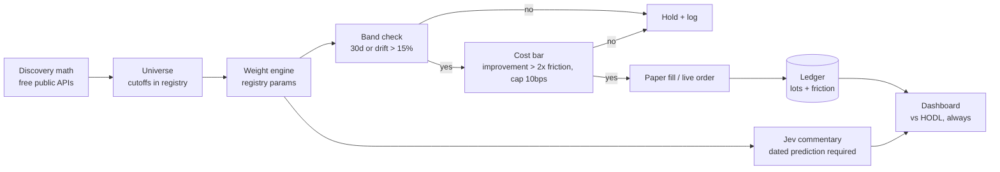
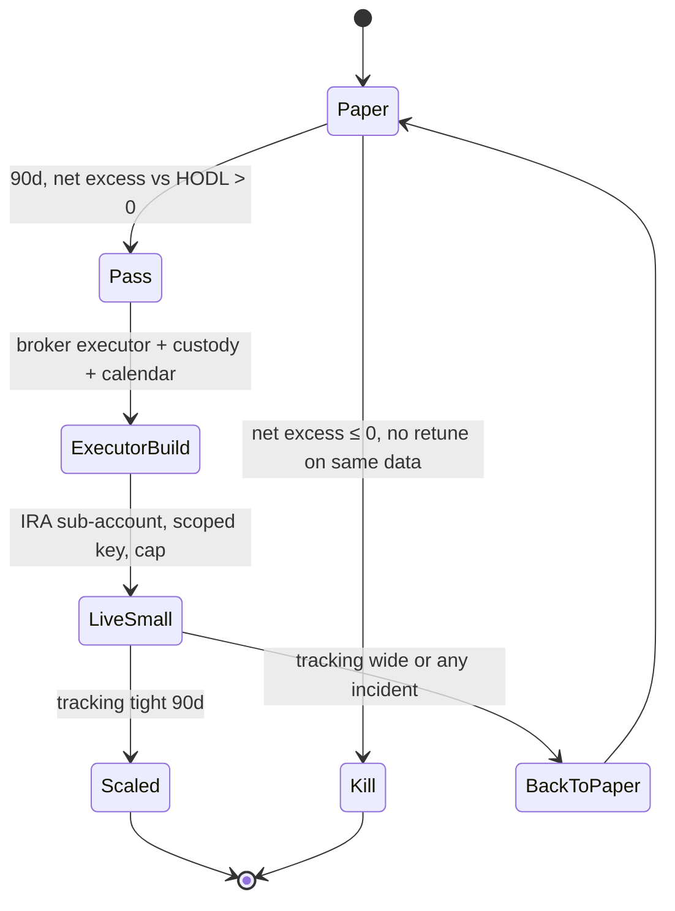

# 006 Equity Index Sleeve — Spec

## Premise

Seven weaknesses were found in v1. This spec is rebuilt from them: each weakness
below becomes a rule with a number, a precedence, or a kill condition. Anything
not traceable to a weakness is cut.

| # | Weakness | Hardened rule |
|---|---|---|
| W1 | Jev explains away bad weeks | Every verdict carries a dated prediction; missing prediction = invalid (§Jev) |
| W2 | "Liquid" undefined | Universe cutoffs numeric in `strategy.yaml`; membership re-verified monthly (§Rules 1) |
| W3 | RSI/funding vague | RSI(14, daily closes) only; funding clause deleted as unobservable (§Rules 2) |
| W4 | Drift trigger ambiguous | Per-position relative deviation > 15% (§Rules 3) |
| W5 | Cost bar gameable | Computable formula + 10bps hard cap (§Rules 3) |
| W6 | "Tight tracking" undefined | 75bps cumulative / 25bps single-leg (§Stage 4) |
| W7 | Trim vs drawdown conflict | Explicit precedence: trim beats tilt; pause blocks buys only (§Rules 5) |

## Strategy

Stoic-style systematic equity index on Robinhood rails, paper-first. Rules
allocate, Jev narrates. Live only IRA-housed, after paper wins. No executor code
until Stage 2 passes.

## Pipeline

## Lifecycle

---

## Rules (values in `strategy.yaml`, frozen before day 1)

1. **Universe (kills W2).** US equities/ETFs with ≥$10M 30-day ADV and ≤5bps
   average spread; ETF wrappers ≥$500M AUM; crypto only via largest-fund wrappers;
   no leveraged/inverse. Membership re-verified monthly; a ticker that breaches
   cutoffs is ejected at the next rebalance trigger (cadence or drift) — never
   mid-month, even in market stress. Ejection logged with cause.
2. **Weights (kills W3).** sqrt(market-cap) base; ±25% tilt by 30d/90d momentum
   rank; RSI(14, daily closes) > 75 → halve weight, proceeds to cash. No funding,
   skew, or sentiment inputs — anything not in the registry cannot move a weight.
   Single-name cap 25%; cash band 10–40%.
3. **Rebalance (kills W4, W5).** 30-day cadence or drift trigger: max over
   positions of |w_actual − w_target| / w_target > 15%. Cost bar, computed per
   rebalance and logged: improvement = total absolute weight deviation in bps of
   portfolio; friction = turnover fraction × 6bps round-trip (3bps/side assumed,
   $0 regulatory dust — SEC fee waived under $500 notional, legs always below).
   Execute iff improvement > 2 × friction AND friction total < 10bps.
   Distribution note: the formula uses portfolio totals deliberately — uneven
   improvement (one position 50bps, rest dust) still executes. Alignment is
   alignment; no per-leg veto exists to be gamed.
4. **Drawdown.** −25% from trailing 126-day peak NAV pauses buys only.
5. **Precedence (kills W7).** Trim beats tilt on the same ticker. Pause blocks
   buys only, never sells — a drawdown must never veto risk reduction. Context
   (regime/flow) modifies within ±10%, never triggers. Logged per read; deleted
   after 90 days of no effect.
6. **No mid-test tuning.** Registry frozen (`frozen_at` set, hash-checked at run
   start). Any edit restarts the 90-day clock.

## Gates

| Gate | Checks |
|---|---|
| G0 data | quotes < 1 day old; corporate-action calendar current |
| G1 integrity | split-adjusted prices only; universe cutoffs re-checked monthly |
| G2 economics | cost bar passes; cash band + single-name cap hold |
| G3 dedupe | one row per (strategy, ticker, date) |

## Jev (kills W1)

Weekly verdict with mandatory dated prediction in observable form:
`ticker operator price by date` (e.g. "SPY > 500 by 2026-10-30" valid;
"sentiment remains positive by Q4" invalid — vague predicate, rejected at log
time). No prediction, or an unobservable one = invalid verdict, excluded from
the hit-rate ledger. Must NOT: size, trigger, delay, override, or explain away
tracking error. Template fields in `strategy.yaml`; logged with guideline version;
scored in post-mortem.

## Dashboard

Index value vs HODL-same-basket (mandatory; day-1 tickers/weights, buy-hold,
dividends reinvested) vs SPY context only. Per-rebalance log (date, legs,
friction, trigger, rule citation). Optionality row (`exit-2: tested <date>`).
Every number sourced + timestamped; no adjectives. No Stoic proxy — wrong asset
class, invites benchmark shopping.

## Custody + execution (Stage 3+, never before)

1. Dedicated sub-account; trade-scope-only revocable key; no withdrawal scope.
2. Per-order + monthly spend caps; one-call killswitch.
3. Cash account; runner is T+1 aware.
4. Quarterly path test ($1 prove-out + cancel drill), logged.
5. Live capital IRA-housed only. Broker code isolated under `src/broker/` with
   zero imports into scan/execute paths.

---

## Acceptance Criteria

### Stage 1 — Paper (zero new infra)

- [ ] `strategy.yaml` frozen + hash-checked; runner reads it exclusively
- [ ] Freeze enforcement: runner asserts file hash vs frozen hash at start and
  refuses to run on mismatch; CI gate fails the build on registry drift
- [ ] Paper fills to `data/paper/006-equity-index.jsonl`, recording signal date,
  fill date, AND settle date (T+1); live-vs-paper comparison joins on settle
  date so Stage 4 never compares unsettled paper against settled live
- [ ] HODL pass/fail + taxable shadow ledger (25% ST, informational)

### Stage 2 — Decide

- [ ] Net excess > 0 net of fees + IRA-zero-tax → Pass
- [ ] ≤ 0 → Kill; no second window on same data

### Stage 3 — Executor + custody (only on Pass)

- [ ] Order-state machine, session calendar, custody stack per §Custody
- [ ] Dashboard legs + optionality row; facts-only review

### Stage 4 — Live small → scaled (kills W6)

- [ ] 90 days live-small; tight = |R_live − R_paper| < 75bps cumulative AND no
  single-leg slippage vs signal > 25bps → Scaled
- [ ] Wide tracking or any credential/session incident → BackToPaper

---

## Success Gate

**Live sleeve beating HODL net of all costs inside guardrails that survive a bad
quarter.** Paper that fails is a successful kill, not a failed track.
