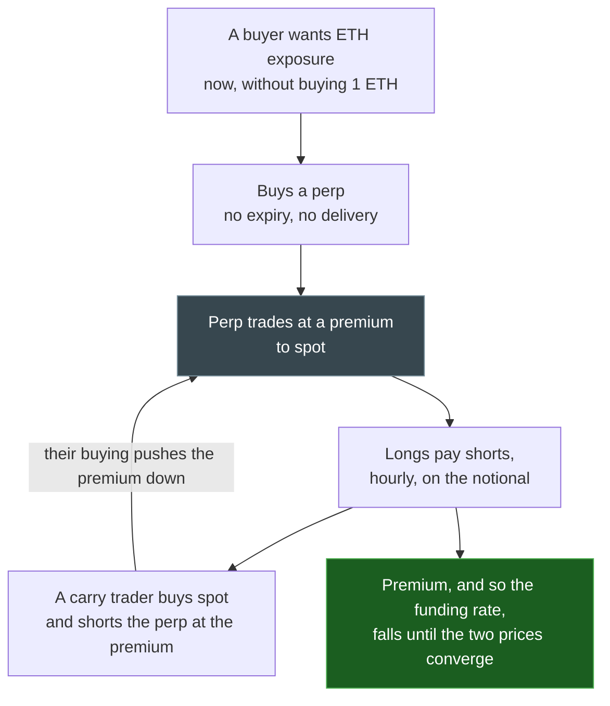
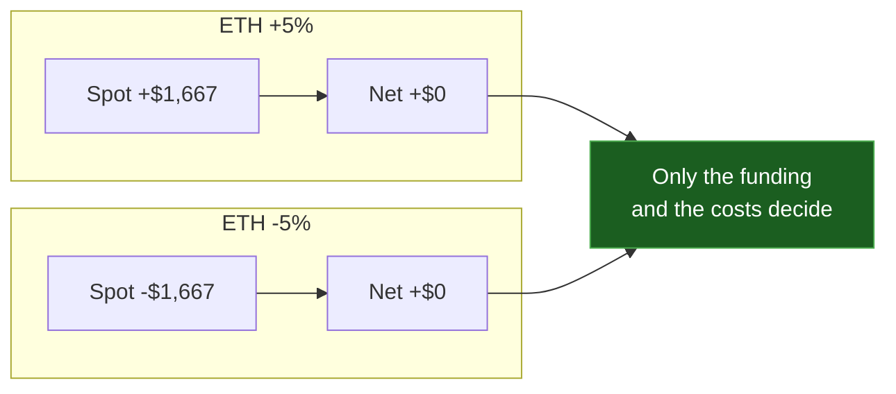
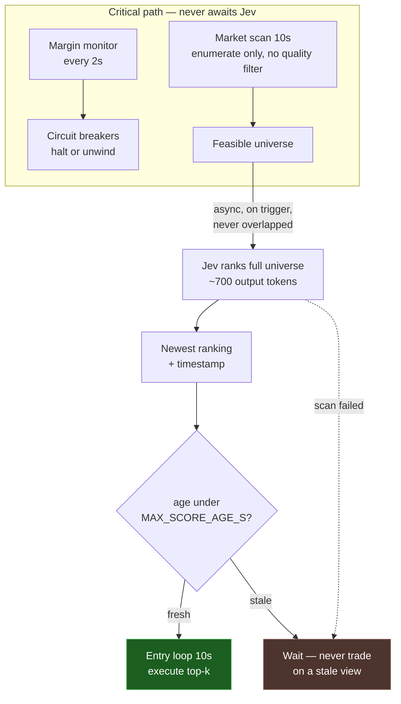

# Funding Rate Harvesting — Implementation Specification

Autonomous delta-neutral funding rate harvesting agent. Jev (System One) gates entries;
deterministic code governs exits, rebalancing, and all safety controls.

**Status:** draft for review
**Supersedes:** nothing — parallel to `docs/STRATEGIES.md`, which argues liquidations are
structurally unwinnable at current infrastructure. This spec takes the opposite position: a
carry trade is **latency-insensitive**, so the infrastructure that kills a liquidation bot
does not kill this one. That asymmetry is the reason to build it.

---

## Primer: what funding rate harvesting actually is

Read this before §0. It is short, and one of its numbers is lower than the target in §12 —
so reading it changes how §12 should be read.

### The instrument

A **perpetual swap** tracks an asset's spot price with no expiry and no delivery. You hold a
position that gains and loses with the price, and you close it whenever you like.

Because nothing ever settles, nothing mechanically forces the contract price back to the spot
price. A perpetual can trade at any premium or discount, indefinitely. That gap is the entire
subject of this document.

### Why funding exists

Leverage demand pushes the perp above spot, and the exchange prices that imbalance with a
periodic payment between the two sides.



Two consequences that matter more than they look:

1. **The premium is a pressure, not an opportunity.** It exists because leverage buyers want
   exposure now and will pay for it. That demand is the source of the yield.
2. **Funding is a transfer, not a print.** It nets to zero across all traders. Every payment
   to a carry trader is a payment out of someone else's position. There is no new money here
   — there is a business model, and you are on the profitable side of it.

### The trade

You are paid to hold two opposing positions. Nothing about it is clever; the work is in the
price feed, the margin, and the costs.

| Leg | Position | Funding effect |
|---|---|---|
| Spot | Long $33,333 of ETH | None |
| Perp | Short $33,333 of ETH | Receives funding hourly |

**Price risk is not removed by this. It is cancelled.** A 5% rally lifts the spot leg by
$1,667 and loses the perp leg $1,667. The position is worth the same either way, and you are
paid $0.375/hour for holding it.



The reason this is worth doing at all: **the short leg cannot be liquidated by an ordinary
move.** At 2× the perp margin is half the notional, so the short survives a **50% adverse
move** against it before the margin is gone; at 3×, **33%**. An asset that can move 33% inside
a day exists, but a *delta-neutral* position where one leg is already short the other has to
diverge before any of this matters. Price is not the risk. §0.3 is.

### Worked example

$50,000 of capital, the measured mean hourly funding of `1.125e-5`, and nothing else moving.

| | 2× | 3× |
|---|---|---|
| Perp notional | $33,333 | $37,500 |
| Long spot | $33,333 | $37,500 |
| Perp margin | $16,667 | $12,500 |
| **Capital committed** | **$50,000** | **$50,000** |
| Funding received | $0.375/h | $0.422/h |
| Annual income | $3,285 | $3,696 |
| **Return on capital** | **6.57%** | **7.39%** |

Note what is *not* in that table: the interest on the margin, the spot custodian's fees, the
$0.375/h that stops if funding goes negative, and the fact that funding was positive in 470
of the last 500 hours — not all 500. On this venue, measured, the negative tail is thin. Do
not assume that holds in a stressed regime.

### Why the headline number is a trap

Funding accrues on the **perp notional**, but the capital you had to commit is the spot
purchase *plus* the margin. That is:

```
return on capital = f / (1 + 1/L)
```

which is **6.57% at 2×** and **7.39% at 3×** — not the 9.86% annualized rate the raw
funding implies. Leverage does not create yield here; it only changes which multiple of the
same yield lands on your equity, and the divisor eats most of the gain. The 2→3× step buys
**0.8 percentage points**.

Three consequences, each of which constrains the design more than any risk parameter does:

- **§12's ">8% annualized" target is above the ceiling.** It cannot be met by this strategy on
  this venue at this funding rate, and no amount of cleverness in the agent changes that. The
  honest gate is the one already stated at Stage 1: **net ROI above zero, versus passive
  hold.**
- **Costs must stay far below 6.6%.** Recovering one 30 bps round trip takes **267 hours —
  11 days** of holding. Two round trips a month is a full year of gross yield spent on
  slippage. This is why holding time is a first-class variable and not an afterthought.
- **The ceiling is structural.** As carry traders compete, funding converges toward the base
  rate minus friction. The 9.86% is a snapshot, and its long-run level is the thing to watch,
  not the funding on any given day.

### So where does the money actually come from?

Not from predicting anything. It comes from three places, and only the third is interesting:

1. **The rate itself.** ~6.6–7.4%/yr gross on capital, at current funding.
2. **Not churning.** The dominant risk is not a bad trade, it is paying 30 bps to take a
   267-hour position. Most of the skill here is *not trading*.
3. **Choosing which premiums to hold, and for how long.** Selecting entries that stay positive
   and avoiding ones that flip, so realized duration beats the average. This is the only
   source of differentiation, and it is what §1 exists to produce.

The value of an agent here is therefore mostly **cost avoidance and selection, not
alpha** — which is a lower, more honest ambition than "find mispricing", and the reason §12's
real criterion is *beat passive hold* rather than a headline return number. If the ranking in
§1 turns out to be uninformative, passive hold wins, and §12 says that is a valid outcome.

---

## 0. Core design principles

Read this section before the rest. It dictates everything downstream.

### 0.1 Jev gates entries only

```
        JEV DECIDES              CODE DECIDES
   ┌────────────────────┐   ┌──────────────────────────────┐
   │ Should I enter?    │   │ When do I exit?              │
   │ Regime classify    │   │ Margin health                │
   │ Position sizing    │   │ Drift correction             │
   │                    │   │ Circuit breakers             │
   │ 200–1500ms OK      │   │ Hard halt                    │
   │ Can afford latency │   │ SUB-SECOND REQUIRED          │
   └────────────────────┘   └──────────────────────────────┘
```

An LLM inference round-trip is 200–1500ms. A perp margin cascade unfolds over seconds. Any
safety-critical path that depends on Jev is architecturally unsound. Jev contributes
*judgment about opportunities* — something that tolerates latency. Code contributes
*survival* — something that does not.

### 0.2 Funding is the PnL driver, not price

This is the single most important thing to get right in the backtest. In a delta-neutral
position, price moves cancel between legs. **Your PnL is the funding accrual, minus costs.**

```
daily PnL%  ≈  24 × hourly_funding_rate  −  daily_funding_cost − rebalance_cost − borrow_cost
```

Sanity anchors for annualization (pure arithmetic, no venue dependency):

- 0.01% per 8h → 0.03%/day → **~10.9%/yr**
- 0.01% per hour → 0.24%/day → **~87.6%/yr**

If your backtest shows a mean funding rate implying >50% annualized with no directional
risk, the model is wrong, not the market.

### 0.3 Cross-venue liquidation is the real risk

Position: long $X spot on venue A, short $X perp on venue B. In a steady uptrend these
offset and you collect funding. The danger is not direction — it is that **the perp leg
liquidates on an intrabar move before your spot leg recovers**, and you realize the loss on
one side while holding an illiquid or stale asset on the other.

If spot and perp are on different venues, you accept:
- CEX/exchange withdrawal latency
- Spot venue outage or API failure during a margin event
- Custodial risk on the collateral

Rule: **the perp leg must always be over-collateralized by a margin that survives a single
adverse candle**, not merely a static margin ratio. See §3.5.

---

### 0.4 The dashboard shows only what is actually happening

**The UI renders active strategies only, and never synthetic data.** This is a correctness
constraint, not a presentation preference.

Three distinct states, and the UI must never blur them:

| State | Meaning | UI treatment |
|---|---|---|
| **No active strategy** | Nothing is producing data | Explicit empty state naming the current track and stage. No rows, no zeros implying activity |
| **Dry run** | Real venue data, execution simulated | Labelled `DRY RUN`. Real prices, simulated fills |
| **Live** | Real data, real execution | Unlabelled, plus a persistent `LIVE` badge |

Two things are forbidden:

1. **Synthetic data in the UI, ever.** Not mock opportunities, not placeholder rows, not
   fabricated "waiting" states that imply a pipeline is running. A dashboard showing invented
   numbers is worse than an empty one, because an empty one is obviously empty.
2. **A mode label that does not match reality.** This is not hypothetical. The current
   `askJev` (`src/jev/classifier.ts`) never calls the TypeSafe API — it validates that a key
   *exists*, then computes local arithmetic with `is_safe` hardcoded to `0.8`.
   `askJevMock` uses `Math.random()`. The existing dashboard labels this "REAL". Every
   judgement on screen is fabricated while the label claims otherwise, which is the specific
   failure this section exists to prevent.

The superseded liquidation pipeline must not be rendered once the funding track is active.
An operator glancing at a populated dashboard should never be misled about which strategy is
running — and should never see a strategy that no longer exists.

When no strategy is active, the dashboard says so and names why. Silence is not an acceptable
representation of "nothing is running."

---

## 1. Jev's Decision Model

### 1.1 Input signals

Feeding raw funding to an LLM wastes it — the numbers are trivially parseable. Feed Jev
*derived, hard-to-compute context* and let it reason over structure. That is where a model
adds value over `if (rate > x) enter`.

```jsonc
{
  "symbol": "ETH",
  "funding": {
    "current_hourly_pct": 0.0087,
    "weighted_8h_equivalent": 0.0091,
    "zscore_vs_90d": 2.34,
    "percentile_vs_1y": 0.97,
    "hours_persistent_same_sign": 31,
    "predicted_flip_probability_24h": 0.18
  },
  "price": {
    "last": 3412.50,
    "realized_vol_24h_annualized": 0.62,
    "vol_percentile_vs_90d": 0.44,
    "trend_7d": "flat"
  },
  "basis": {
    "perp_premium_vs_spot_pct": 0.081,
    "annualized": 7.39
  },
  "regime": "bullish_trending",
  "account": {
    "equity_usd": 50000,
    "deployed_usd": 40000,
    "available_margin_pct": 0.34,
    "open_positions": 0
  },
  "venue_health": {
    "spot_venue": "ok",
    "perp_venue": "ok",
    "last_api_success_age_s": 4
  }
}
```

**On `zscore_vs_90d` and the other derived fields.** These are where the strategy's
information content lives. A single funding rate is not tradeable — rates mean-revert, and
entering on a spike that reverts in the next interval captures the worst entry. The
question Jev answers is *"is this level persistent or is it about to collapse,"* which is a
pattern question, not a threshold question.

### 1.2 Decision logic

**Code enumerates opportunities. Jev judges them. Code never judges quality.**

An earlier draft of this spec contradicted itself on this point. It stated that "Jev does
not emit a threshold rule; thresholds are enforced in code," then routed on `zscore > 2.0`,
`percentile < 0.90`, and `predicted_flip_probability > 0.35` before Jev was ever called.
That is code deciding what makes a trade good, with Jev ratifying the result.

That arrangement destroys the thesis. If code selects the opportunities, the score is never
tested against anything difficult, and "if calibration is flat, remove Jev" becomes a
guaranteed outcome rather than a finding.

Code applies only constraints that are not judgments about quality:

| Constraint | Enforced in code | Why this is not a quality judgment |
|---|---|---|
| Available margin, position cap, leverage ≤ 3× | yes | You cannot spend capital you do not have |
| Live spread and slippage reality | yes | Costs are measured, not opinionated |
| Price and funding staleness | yes | Stale data makes any judgment meaningless |
| Venue health, spot/perp reconciliation | yes | Trading a broken feed is not a strategy question |
| Funding rate is positive | yes | A negative rate is a payment, not an opportunity |

If code filtered on attractiveness — percentile, z-score, hours of persistence, volatility
percentile — it would be selecting on trade quality, which is Jev's job. It does not.

### 1.3 Viability scoring

Jev returns a continuous viability score in `[0, 1]` for every enumerated market, plus a
shortlist. A score is strictly better than an `ENTER`/`SKIP` verdict here:

- **Buckets properly for ECE and Brier.** A binary verdict discards the ordering that makes
  calibration measurable.
- **Ranking across markets requires scores.** N binary verdicts cannot be ranked.
- **Every scan produces a labelled point**, not only the trades actually taken. Calibration
  needs negative examples, and a shortlist-only design only ever records positives.

The score is a *self-assessment* and is uncalibrated until §5.3 proves otherwise. Store it
regardless — the calibration curve is produced by tracking it, which is the entire reason to
log it.

No code rule converts a score into a trade decision. Ranking selects the top-k by score, and
the floor for acting on any of them is `MIN_VIABILITY_SCORE`, a configured risk parameter in
the same family as max position count — not a hardcoded opinion about what makes a trade
worth taking.

### 1.4 Output contract

```jsonc
{
  "scan_id": "01JQ8X2M4N",
  "universe_size": 234,
  "scores": {
    "ETH": { "viability": 0.81, "duration_hours": 42, "roi_pct": 0.94 },
    "SOL": { "viability": 0.44, "duration_hours": 11, "roi_pct": 0.21 },
    "ARB": { "viability": 0.07 }
  },
  "shortlist": ["ETH"],
  "reasoning": "ETH funding at 97th percentile, 31h persistent, perp premium annualized "
             + "7.4% supports carry without imminent mean reversion. SOL carry is real but "
             + "thinner and mean-reverts faster. ARB funding is near zero after costs.",
  "invalidators": ["ETH funding below 0.003% for 2 consecutive hours",
                   "ETH vol above 95th percentile"]
}
```

`viability` is required for every enumerated market, not just the shortlist. The
shortlist is a convenience for sizing and display; the full `scores` map is what makes
calibration possible, because it records the rejected cases too.

`invalidators` is the field to insist on. It forces the model to name conditions that would
void its own thesis, and code checks them (§2.4). A model that cannot say what would falsify
its call has not reasoned about it.

### 1.5 Universe feasibility constraints

Not all 234 perp markets are tradeable, and §1.2's "code does not judge quality" does not
mean code admits everything. The distinction is that these are feasibility tests, not
attractiveness tests — each answers "can this trade exist?", not "is this trade good?".

Applied before enumeration reaches Jev:

| Constraint | Rule | Rationale |
|---|---|---|
| Funding history depth | ≥ 90 days continuous | z-score and percentile are undefined without it |
| Bid-ask spread | ≤ 10 bps | Above this, §4.4's slippage budget is fiction |
| Open interest | ≥ $10m | Thin books liquidate you before funding pays |
| Listing age | > 30 days | New listings have no usable percentile |
| Mark/oracle freshness | < 60s | Stale marks corrupt liquidation distance |
| Spot venue coverage | Long leg must be reachable | Half the hedge is not a hedge |

Expect this to reduce the universe to roughly **30–50 markets**. That is the intended
consequence: a market that fails a feasibility test is one where the trade cannot be executed
at modelled cost, and Jev's judgement of it is moot.

**Diagnostic that must be logged:** `universe_size` versus `enumerated` on every scan (§5.1).
If feasibility filtering ever starts selecting on attractiveness, that ratio is where it
becomes visible.

---

## 2. Operational Workflow

### 2.1 Polling cadence

Funding accrues on discrete intervals (hourly on Hyperliquid, 8h on most EVM perps). Polling
faster than the accrual interval adds cost and noise without adding information.

| Activity | Cadence | Rationale |
|---|---|---|
| Funding rate read | 60s | 1–2% of interval; catches the timestamp |
| Mark price / liquidation distance | **5s** | This is the safety-critical path |
| Spot price | 15s | Balance against lag; mark price is perp-native |
| Account state read | 10s | Drift and margin |
| Full-universe Jev scan | **Async, on trigger — not a timer** | See below |
| Health factor / margin check | 2s | Deterministic hard stop |

Jev is not polled, and it is not in the entry path. A scan over 234 markets must emit 234
numbers — roughly 700 output tokens. At a realistic 200 tok/s decode that is ~3.5s before
prefill is counted. No model size makes that subsecond at a quality worth trusting for the
judgment that matters.

So the scan runs off the critical path, and the entry loop consumes its **freshest result**
under a staleness bound.

| Loop | Cadence | Contains |
|---|---|---|
| Margin monitor | 2s | Deterministic only. No AI. |
| Market scan | 10s | Enumeration only. No quality filter. |
| Jev ranking | On trigger, async | Scores the entire universe |
| Entry | 10s, on market scan | Reads newest ranking; acts only if `age < MAX_SCORE_AGE_S` |

The asymmetry still holds and is still the point: **margin monitoring at 2 seconds, Jev
whenever it can afford to be.** Making them equal either makes Jev uselessly slow or margin
monitoring uselessly blind.

`MAX_SCORE_AGE_S` is not a quality judgment. It is the same data-integrity rule as "do not
trade on a stale price," applied to the model's view. A stale ranking is not a bearish
ranking; it is no ranking at all.

Trigger conditions for a scan: new market enters the feasible universe, an open position's
score falls below `MIN_VIABILITY_SCORE`, funding crosses zero on a shortlisted market, or
`MAX_SCORE_AGE_S` has elapsed. In other words, when the previous answer might no longer
hold.

### 2.2 Data sources

| Need | Source | Latency tolerance |
|---|---|---|
| Funding rate | Exchange API (`info` endpoint) | < 60s |
| Mark price + liq price | Exchange API, **not** spot | < 5s |
| Spot price | Exchange spot API or Chainlink | < 15s |
| Position state | Exchange API, private | < 10s |

**Use the exchange's mark price for liquidation distance.** Liquidation triggers off mark
price, not last-trade. Computing it from spot introduces basis drift exactly when it matters.

### 2.3 Position lifecycle

```
   ┌──────────┐   funding z>2 & persistent      ┌──────────┐
   │  FLAT    │─────────────────────────────────▶│  PENDING │
   │          │◀─────────────────────────────────│          │
   └──────────┘   order failed / timeout         └──────────┘
        ▲                                          │ both legs
        │                                          │ filled
        │                                          ▼
        │      drift > tol OR vol spike        ┌──────────┐
        ├──────────────────────────────────────│   OPEN   │
        │◀─────────────────────────────────────│          │
        │      funding compresses / margin      └──────────┘
        │      risk / invalidator / time limit
        ▼
   ┌──────────┐
   │UNWINDING │
   └──────────┘
```

`PENDING` exists because legs are not atomic across venues. Handling of the
spot-succeeds-perp-fails case is in §4.3 and is the highest-risk code in this system.

### 2.4 Rebalance triggers

| Trigger | Threshold | Action |
|---|---|---|
| Delta drift | > 2% of notional | Correct |
| Liquidation distance | < 25% | Correct, elevated urgency |
| Liquidation distance | < 15% | **Hard halt new entries**, unwind only |
| Funding flips negative | 2 consecutive hours | Review; unwind if persists 6h |
| Jev invalidator triggered | any | Review exit |
| Time-based review | every 6h | Re-evaluate thesis |

### 2.5 Exit triggers

Ordered by priority — first match wins:

1. **Liquidation distance < 12%** → unwind immediately, highest priority
2. **Delta drift > 8%** → unwind and re-enter clean
3. **Funding negative 6 consecutive hours** → unwind (carry thesis dead)
4. **Jev invalidator** → unwind
5. **Time limit: 14 days** → unwind regardless (bound capital lockup)
6. **Equity drawdown > 10% from peak** → unwind, session halt

---

## 3. Delta-Neutral Hedge Mechanics

### 3.1 Sizing formula

```pseudocode
function sizePosition(fundingRate, equity, config) -> {spotUsd, perpQty, marginUsd} {
    // 1. Determine effective notional. Volatility caps exposure, not just capital.
    volScalar = clamp(1.0 - (annualizedVol - 0.40) / 0.60, 0.3, 1.0)
    targetNotional = min(
        equity * config.maxLeverage,
        equity * config.maxAllocationPct,
        config.maxNotionalUsd
    ) * volScalar

    // 2. Conversion: carry decays as basis compresses. Stop paying for carry you won't get.
    basisAnnualized = perpPremiumVsSpot * 365 * 24
    if (basisAnnualized < fundingAnnualized * config.minBasisRatio) {
        reject("basis compression makes carry uneconomic")
    }

    // 3. Delta hedge. perpQty is in units; spot is in value.
    spotUsd    = targetNotional
    perpQty    = targetNotional / markPrice

    // 4. Margin must survive an adverse move, not just meet maintenance (see §3.5)
    requiredMargin = worstCaseLoss(targetNotional, config.stressVol) * config.marginBuffer
    marginUsd = max(requiredMargin, targetNotional / config.maxLeverage)

    if (marginUsd > equity * config.maxMarginPct) {
        reject("margin requirement exceeds allocation cap")
    }
    return { spotUsd, perpQty, marginUsd }
}
```

### 3.2 Perfect neutrality vs. bounded drift

Do **not** attempt perfect delta neutrality. Target zero and you rebalance on every tick,
paying gas and slippage to correct noise. Instead:

| Band | Tolerance | Action |
|---|---|---|
| Target | 0% drift | — |
| Accept | ±2% | None |
| Correct | > 2% | Rebalance |
| Unwind | > 8% | Exit |

### 3.3 Collateral management

```
Equity $50k, target notional $32k

  Spot leg:   $32k ETH        (held on spot venue)
  Perp margin: $14.5k USDC    (collateral on perp venue)
  Free:        $3.5k          (buffer for slippage + fees)

  Perp leverage = $32k / $14.5k ≈ 2.2x
```

Leverage around **2–3×**, not the 10–20× the perps permit. Maximum leverage optimizes the
return on an event where nothing goes wrong, and is catastrophic on the event where
something does. At 2.2×, a 45% adverse move is required to liquidate; at 10× it is 10%.

### 3.4 Rebalancing frequency

Drift-triggered, not scheduled. Additionally rebalance when **any** hold:

- Funding has flipped sign once (thesis invalidated even if drift is fine)
- Volatility moves more than 1 standard deviation

### 3.5 Liquidation safety buffer

Compute distance to liquidation from the venue's mark price and your maintenance margin:

```pseudocode
function liquidationDistance(markPrice, liquidationPrice, perpQty, marginUsd) -> pct {
    // Direction-aware: a short liquidates on the way UP
    adverseMove = (liquidationPrice - markPrice) / markPrice   // positive = short risk
    lossAtLiq   = abs(perpQty) * adverseMove * markPrice
    cushion     = (marginUsd - lossAtLiq) / marginUsd
    return cushion   // 0.0 = at liquidation, 1.0 = no margin at all
}
```

Gate: **no position opens unless post-entry distance ≥ 25%.** At 2.2× leverage that is
roughly a 20% adverse move, which no plausible intrabar reaches.

### 3.6 Position sizing and range-selection policy

Stage 1 gates on evaluating this policy, so it must be concrete rather than implied. Four
steps, in order. Nothing here reads the viability score except step 1 — sizing is
volatility- and capital-driven, never model-driven (§1.2).

**Step 1 — select.** From Jev's ranking of the feasible universe (§1.5), take markets in
descending viability order while `viability >= MIN_VIABILITY_SCORE` and fewer than
`MAX_CONCURRENT_POSITIONS` are open.

**Step 2 — volatility scalar.**

```
volScalar = clamp(1.0 - (annualizedVol - 0.40) / 0.60, 0.30, 1.00)
```

At 40% annualized vol the scalar is 1.0. At 70% it is 0.5. At 100% it floors at 0.30. Volatility
caps exposure; it does not merely gate it.

**Step 3 — size and derive leverage.**

```
targetNotional = min(
  MAX_POSITION_NOTIONAL_USD,
  availableMargin × MAX_LEVERAGE,
  equity × volScalar × MAX_LEVERAGE,
)

marginRequired = targetNotional / MAX_LEVERAGE
leverage       = clamp(targetNotional / marginRequired, 1.0, MAX_LEVERAGE)
```

**Leverage is an output, not an input.** It falls out of the notional the caps allow. There is
no "choose 2× or 3×" decision to make, which is what makes the stress ladder in §7.3
meaningful: it tests a leverage that sizing already derived rather than one a human picked.

**Step 4 — entry gates, both mandatory.**

```
Liquidation distance at entry   >= LIQUIDATION_DISTANCE_ENTRY (25%)
Stress ladder (7.3) preserves  >= MIN_SURVIVING_BUFFER (0.15)
```

`MIN_SURVIVING_BUFFER = 0.15` is set here because §7.3 referenced `config.minBuffer` without
a value. At 2× leverage a 35% adverse move consumes ~17.5% of margin, which clears 0.15
barely; at 3× it consumes ~26% and fails. So the ladder is what actually enforces the 2–3×
cap in practice, and `MIN_SURVIVING_BUFFER` is the number that does it.

If the ladder fails, **downsize to the notional that survives it**, rather than rejecting
outright. A 2× position that survives a 35% shock is still a valid carry trade; refusing it
because 3× failed would discard a good trade for an arithmetic reason.

**Out-of-sample requirement.** Stage 1 must evaluate this policy against simpler variants, not
just report its own result:

| Variant | Purpose |
|---|---|
| Fixed 2× leverage | Baseline |
| Fixed 3× leverage | Shows whether the vol scalar earns its complexity |
| `volScalar` sizing, no viability filter | Isolates Jev's contribution |
| Full policy | Selection + vol scalar + both gates |

If the full policy does not beat fixed-2× after costs, **the volatility scalar and the
viability filter are both unjustified and should be deleted.** A policy that cannot beat a
constant is adding risk without adding return. Record which variant won, whatever it is.

---

## 4. Execution Architecture

### 4.1 RPC sequence

```
1. GET  funding rate + mark price + liq price    (perp venue)
2. GET  spot price                                 (spot venue)
3. GET  account state: equity, margin, positions   (perp venue)
4. POST OpenRouter → Jev                            (only if thresholds pre-pass in code)
5. POST simulate spot order                         (must succeed before proceeding)
6. POST simulate perp order                         (must succeed before proceeding)
7. EXECUTE spot order
8. EXECUTE perp order        ← window of risk opens here
9. VERIFY delta; correct if drift > 2%
```

Both simulations **before** either live order. A live order that reverts after its
counterpart filled leaves you naked.

### 4.2 Transaction structure

**Not atomic.** Different venues, different chains, no shared transaction. The sequence in
§4.1 is sequential and you live with the gap between step 7 and step 8.

Mitigations:

- Minimize the window: pre-sign the perp order, submit immediately after spot confirms
- Pre-fund both venues so no withdrawal sits in the critical path
- Size the first leg smaller (spot first at 60%, then top up) to bound the naked window

### 4.3 Partial failure — the dangerous case

This is the highest-risk code path in the system.

```
SCENARIO A: spot fails, perp not sent        → SAFE. No position. Retry or abort.
SCENARIO B: spot succeeds, perp fails       → NAKED LONG. Unexpected exposure.
SCENARIO C: both succeed                    → Hedge established.
SCENARIO D: spot succeeds, perp partially  → PARTIALLY NAKED. Size-dependent exposure.
```

Handling for **B and D**:

```pseudocode
function onSpotFilledPerpFailed(spotFilledUsd, perpFilledUsd) {
    nakedExposure = spotFilledUsd - perpFilledUsd

    // Immediate: attempt perp hedge with reduced size, aggressive limit
    for attempt in 1..3:
        result = executePerpReduceOnly(nakedExposure)
        if result.success: return

        // Failing: unwind the spot leg rather than sit naked
        executeSpotSell(nakedExposure)          // revert to flat
        alertCritical("both legs failed, reverted to flat")
        circuitBreaker.trip("dual-leg-failure")
}
```

The fallback is **unwinding the spot leg, not waiting.** A naked long in a market you
entered for a carry trade is pure directional risk with no thesis behind it. If the hedge
can't be established, the trade never existed.

### 4.4 Slippage budget

| Leg | Limit | Rationale |
|---|---|---|
| Spot | 10 bps | ETH is deep; tighter is achievable |
| Perp | 10 bps | Same |
| Rebalance | 25 bps | Accept worse to correct risk promptly |

Per-trade slippage budget: **30 bps round trip**. With funding at 0.009%/hour, this is
recovered in ~20 minutes of positive carry. On a position held 42 hours, slippage is noise.
On one held 20 minutes, it is the entire trade. The backtest must model this asymmetry —
short holds are unprofitable and that is a real result, not a modeling artifact.

---

## 5. Logging & Observability

### 5.1 JSONL schemas

Every line is one event. Append-only, one JSON object per line, in `logs/`.

**Scan (Jev ranked the full universe)**

```json
{"ts":"2026-10-05T14:32:08.412Z","event":"scan","scan_id":"01JQ8X2M4N","universe_size":234,"enumerated":231,"shortlist":["ETH","SOL"],"jev":{"latency_ms":3480,"input_tokens":11480,"output_tokens":712,"model":"jev-scan-v1","scores":{"ETH":{"viability":0.81,"duration_hours":42,"roi_pct":0.94},"SOL":{"viability":0.44,"duration_hours":11,"roi_pct":0.21},"ARB":{"viability":0.07}}},"invalidators":["ETH funding below 0.003% for 2 consecutive hours"]}
```

This is the calibration record. It carries every score including the rejected ones, so
rejected markets become labelled negatives. `universe_size` versus `enumerated` shows how
many the code-side capital and integrity constraints removed — and per §1.2 that number must
reflect feasibility only, never attractiveness.

**Decision (entry acted on a ranking)**

```json
{"ts":"2026-10-05T14:32:11.204Z","event":"decision","run_id":"01JQ8X2M4N","symbol":"ETH","scan_id":"01JQ8X2M4N","score_age_s":2.8,"inputs":{"funding_hourly_pct":0.0087,"zscore":2.34,"percentile_1y":0.97,"hours_persistent":31,"vol_24h":0.62,"vol_percentile":0.44,"basis_annualized":7.39,"regime":"bullish_trending"},"viability":0.81,"rank":1,"code_gates":{"margin_ok":true,"venue_ok":true,"data_fresh":true},"decision":"ENTER","position_usd":32000}
```

`score_age_s` is recorded on every decision so that a regression in Jev availability shows
up as stale entries rather than as mysteriously flat PnL.

**Entry**

```json
{"ts":"2026-10-05T14:32:48.771Z","event":"entry","run_id":"01JQ8X2M4N","symbol":"ETH","spot":{"qty_eth":9.38,"notional_usd":32009.44,"slippage_bps":4.2,"venue":"spot_custodian","tx_hash":"0x..."},"perp":{"qty_eth":-9.38,"notional_usd":32000.11,"slippage_bps":3.1,"venue":"hyperliquid","tx_hash":"0x...","leverage":2.21},"residual_delta_pct":0.03,"duration_ms":6234}
```

**Leg failure**

```json
{"ts":"2026-10-05T15:08:02.113Z","event":"partial_fill_recovery","run_id":"01JQ8X2M4N","symbol":"ETH","spot_filled_usd":32009.44,"perp_filled_usd":0,"naked_exposure_usd":32009.44,"recovery":"perp_retry","recovery_attempts":2,"recovery_success":true,"duration_ms":1877}
```

**Exit**

```json
{"ts":"2026-10-05T16:14:03.552Z","event":"exit","run_id":"01JQ8X2M4N","symbol":"ETH","reason":"funding_negative_6h","funding_at_entry_pct":0.0087,"funding_at_exit_pct":-0.0012,"held_hours":1.68,"funding_accrued_usd":42.11,"fees_usd":18.90,"slippage_usd":22.44,"realized_pnl_usd":0.77,"realized_roi_pct":0.0024,"max_favorable_excursion_usd":118.30,"max_adverse_excursion_usd":-64.20}
```

**Safety control trip**

```json
{"ts":"2026-10-05T16:20:00.001Z","event":"circuit_breaker","run_id":"01JQ8X2M4N","breaker":"max_daily_loss","tripped":true,"value":0.041,"threshold":0.03,"action":"block_new_entries","auto_reset":false}
```

**Jev failure**

```json
{"ts":"2026-10-05T14:35:00.882Z","event":"jev_error","run_id":"01JQ8X2M4N","error":"rate_limit_429","latency_ms":30211,"retry_count":3,"fallback":"no_entry","note":"fail-closed: uncertainty never opens a position"}
```

That last one matters: **Jev failures must fail closed.** A missing decision means no entry.
Never default to a permissive action on error.

### 5.2 Outcome tracking

Per position, joined on `run_id`:

| Metric | Why it matters |
|---|---|
| `realized_roi_pct` | The only number that matters |
| `funding_accrued_usd` | Isolates carry from execution quality |
| `fees + slippage` | Cost of being wrong about *timing* |
| `max_adverse_excursion` | Would it have liquidated? By how much? |
| `held_hours` | Validates predicted duration |
| `predicted vs actual ROI` | Forecast error input |

`max_adverse_excursion` is the field that tells you whether your margin buffer is real. If
MAE approaches your liquidation distance, you were closer than you thought.

### 5.3 Calibration metrics

The reason to log `viability` is to produce this table.

**Viability calibration**

```
bucket_viability:  predict(P(profit | viability in bucket))
  0.55–0.60 →  n=12,  actual 0.50,  gap -0.05
  0.60–0.65 →  n=23,  actual 0.61,  gap +0.01
  0.65–0.70 →  n=31,  actual 0.58,  gap -0.07
  0.70–0.75 →  n=44,  actual 0.70,  gap -0.01
  0.75–0.80 →  n=58,  actual 0.71,  gap -0.06
  0.80–0.85 →  n=67,  actual 0.74,  gap -0.10
```

**Expected Calibration Error (ECE):**

```
ECE = Σ (n_b / N) × |predicted_b − actual_b|
```

Also track **Brier score** (`mean((outcome − viability)²)`, lower better) and **forecast
error** (`actual_roi − predicted_roi`) split by predicted duration bucket.

**Sample size for ECE.** ECE < 0.10 on 100 positions is a weak constraint — sampling noise
alone can produce 0.12 at n=100. Report the standard error alongside ECE, and treat the
target as **ECE < 0.10 with a 95% CI excluding 0.15**. If the interval straddles 0.15, the
answer is "not yet measured," not "passed." Bootstrap the bucket assignment rather than
quoting a point estimate. Note also that §5.4 may remove `duration_hours` outright, which
would drop the duration-bucket split from this table.

**Every scan is a labelled data point, including the markets not taken.** Because §1.2 moved
quality judgment entirely into Jev and §5.1 logs the full `scores` map, rejected markets
become observed negatives. This is a direct benefit of the inverted funnel and it is not a
small one: the low end of the scale is where calibration is hardest, and a shortlist-only
design never produces a single observation below the entry floor.

Two consequences for the sample-size argument:

- **Calibration N grows at the scan rate, not the trade rate.** One scan over 234 markets
  contributes 234 points, most of them negatives.
- **But negatives are only labelled if the counterfactual is knowable.** A market that was
  never traded has no realized outcome, so it cannot be scored without either simulating it
  (§9) or holding it. Until §9's backtest can replay a scan, calibrate on **taken** trades
  only, and treat the full-universe scores as a ranking to be validated out-of-sample rather
  than as a labelled set.

That distinction is the honest position: the scan log tells you what Jev believed and when.
It does not tell you whether it was right until something either trades it or replays it.
No conclusion is statistically meaningful below ~100 *resolved* observations regardless of how
many scores are logged — say so in the report rather than reading noise.

---

## 6. Data Pipeline

### 6.1 Funding aggregation

```pseudocode
async function pollFunding(venue, symbol) {
    try {
        res = await withTimeout(fetch(`${venue}/info`), 3000)
        rates = parseFundingHistory(res)         // venue-specific
        return {
            current:   rates.latest,
            zscore:    (rates.latest - mean90) / stddev90,
            percentile: rank(rates.latest, rates.1y),
            persistenceHours: consecutiveSameSign(rates),
            staleness: now() - rates.latestTimestamp
        }
    } catch (err) {
        metrics.increment("funding.poll.failed", { venue })
        return null                              // caller treats null as NO ENTRY
    }
}
```

Three rules:

- **A failed fetch is `null`, never a stale value.** Trading on stale funding is how you
  enter a position that no longer exists.
- **Independent health tracking per venue.** One venue failing must not block the other.
- **Warm the history cache before first use.** `zscore_90d` needs 90 days; you cannot
  compute it at startup. Pre-fetch at boot or persist it across restarts.

### 6.2 Spot price feeds

Use **both**, with a defined precedence:

1. Exchange spot API (fast, matches your execution venue)
2. Chainlink (independent, slower, useful as a sanity check)

If they diverge > 50 bps, treat it as a data-integrity fault and block entry. On a
delta-neutral strategy the spot price's only jobs are sizing and basis computation, so the
50 bps band is about catching broken feeds, not arbitraging.

### 6.3 Margin monitoring

```pseudocode
every 2 seconds:
    markPrice    = fetchMarkPrice()
    liqPrice     = fetchLiqPrice()
    marginRatio  = fetchMarginRatio()

    distance = liquidationDistance(markPrice, liqPrice, position.qty, marginUsd)

    if distance < 0.12:  unwindNow()                    // §2.5 priority 1
    elif distance < 0.15: breaker.blockEntries = true
    elif distance < 0.25: rebalance()

    // Independent hard stop — never gated on anything else
    if marginRatio < maintenanceMargin + 0.02:
        breaker.trip("margin_critical")
```

This loop has **no Jev dependency and no network dependency on the AI provider.** If
OpenRouter is down, margin monitoring is unaffected. That isolation is deliberate.

### 6.4 Refresh cadence

| Data | Interval | Staleness limit |
|---|---|---|
| Funding rate | 60s | 5 min → else block entry |
| Mark price | 5s | 30s → else unwind |
| Liquidation price | 5s | 30s → else unwind |
| Spot price | 15s | 2 min → else block entry |
| Account state | 10s | 1 min → else block entry |
| Margin ratio | 2s | — |

### 6.5 History persistence and cold start

A 90-day z-score window is 2,160 hourly points. That cannot be computed at cold start, and
recomputing it on every restart makes the process unusable.

**Storage: PostgreSQL.** One table, append-only, shared with §8.2's position state.

```sql
CREATE TABLE funding_history (
  symbol       text        NOT NULL,
  ts           timestamptz NOT NULL,
  funding_rate double precision NOT NULL,
  PRIMARY KEY (symbol, ts)
);
CREATE INDEX funding_history_symbol_ts ON funding_history (symbol, ts DESC);

-- Derived, recomputed rather than trusted
CREATE TABLE funding_stats (
  symbol        text PRIMARY KEY,
  window_hours  int  NOT NULL,
  mean_rate     double precision NOT NULL,
  stdev_rate    double precision NOT NULL,
  zscore        double precision NOT NULL,
  percentile    double precision NOT NULL,
  computed_ts   timestamptz NOT NULL
);
```

**Staleness.** A row is stale if `now() - ts > 2 × funding_interval`. Stale rows are never
read as if current: a funding read that fails returns `null`, never the last known value
(§6.4). Derived stats carry `computed_ts`; if older than one funding interval they are
recomputed before use.

**Startup validation, and it fails loudly:**

1. Check each candidate symbol has ≥ 90 days of contiguous history.
2. Symbols failing this are excluded from the universe and the exclusion is logged with a
   reason. They are not silently dropped.
3. **If fewer than `MIN_FEASIBLE_MARKETS` (10) symbols pass, the agent refuses to arm
   entries** and says so. A z-score computed from a partial window is not a z-score, and
   trading on one is worse than not trading.

**On restart with an existing cache:** gap-fill, do not rebuild. Query the newest `ts` per
symbol, fetch forward from there, and recompute derived stats over the full 90-day window.
Recomputing from zero on every restart turns a 2-second start into a 10-minute one.

**Cache integrity.** `funding_history` is derived from a public API and is safe to discard.
If it is corrupt, delete and re-fetch. `positions` is not — it holds real capital state and
must never be dropped to recover. If positions and cache disagree on an open position, the
**position** is authoritative and the cache is rebuilt around it.

### 6.6 Pagination loop for `fundingHistory`

The endpoint returns at most **500 points per request** and silently truncates wider windows.
A 30-day request returned only Sept 5–26, with no error. Silent truncation is the dangerous
part: a naive backfill produces a short, plausible-looking history rather than an obvious
failure.

**Loop, walking backwards from now:**

```
cursor        = now()
oldestSeen    = cursor
allPoints     = []
perSymbol     = 0

while perSymbol < MAX && (cursor - oldestSeen) >= HISTORY_DAYS * 86_400_000:
  page = fetch(symbol, endTime = cursor)            # ≤ 500 points
  if page.length == 0: break                        # reached listing age
  allPoints += page
  oldestSeen = min(ts of page)
  cursor    = oldestSeen - 1                        # 1ms overlap: never a gap
  perSymbol += 1
```

**Required assertions.** Each is a test, and each fails the build:

| Assertion | Failure meaning |
|---|---|
| `page.length <= 500` | Assumption wrong; the cap changed |
| Returned points are **contiguous** — no gap between consecutive `ts` | Silent truncation or a hole |
| Monotonically decreasing `ts` within a page | Unreliable pagination |
| Union covers `HISTORY_DAYS` contiguously | Incomplete history; symbol fails §6.5 |
| `allPoints` has no duplicate `ts` | Overlap bug in the cursor arithmetic |

The 1 ms overlap is deliberate. It makes gaps impossible to create, and duplicates are
removed on insert via `ON CONFLICT DO NOTHING`.

**Budget:** 90 days at hourly is 2,160 points ≈ **5 requests per symbol**. Twelve months is
~18. Per §1.5 the universe is 30–50 symbols, so a full 12-month warm is roughly 540–900
requests. Do it once, persist to §6.5, and never repeat it in the hot path.

**If pagination breaks mid-backfill:** abort the backtest. Do not run on a partial history —
a z-score over 40 days instead of 90 will quietly change every percentile the policy depends
on, and the result will look fine.

---

## 7. Risk Controls

All hardcoded. None consults Jev.

### 7.1 Position and allocation limits

| Control | Limit |
|---|---|
| Max position notional | $50,000 |
| Max leverage | 3× |
| Max capital per venue | 60% of equity |
| Max concurrent positions | 3 |
| Max new entries per hour | 2 |
| Min margin buffer at entry | 25% |

### 7.2 Circuit breakers

| Breaker | Threshold | Action | Auto-reset |
|---|---|---|---|
| `daily_loss` | 3% of equity | Block entries 24h | No — manual |
| `max_dd` | 10% from peak | Halt all, unwind all | No — manual |
| `margin_critical` | Margin ratio near maintenance | Unwind immediately | No |
| `dual_leg_failure` | Both legs failed once | Block entries 24h | No |
| `data_integrity` | Price feeds diverge > 50 bps | Block entries until resolved | Yes |
| `jev_unavailable` | 3 consecutive failures | Block entries 1h | Yes |
| `latency_spike` | Mark price age > 30s | Unwind and halt | Yes |

Most breakers are **not** auto-reset. A bot that automatically resumes after a serious
failure is a bot that repeats the failure.

### 7.3 Liquidation prevention

```
Entry gate:   post-entry liquidation distance ≥ 25%
Live gate:    continuous at 2s cadence
Hard stop:    unwind at < 12%
Escalation:   block entries at < 15%
```

And the stress test that must run **before** every entry:

```pseudocode
function stressTest(notional, leverage, config) -> bool {
    for shock in [0.05, 0.10, 0.20, 0.35]:
        loss = notional * shock
        remainingMargin = marginUsd - loss
        if remainingMargin / marginUsd < config.minBuffer:
            reject("leverages out at ${shock*100}% adverse move")
    return true
}
```

If any shock in that ladder breaks the buffer, the position is too leveraged — regardless of
what Jev's viability score says.

---

## 8. Node.js Integration

### 8.1 OpenRouter call

```typescript
interface JevRequest {
  model: string;            // via OpenRouter
  messages: Array<{ role: 'system' | 'user'; content: string }>;
  temperature: number;      // 0.1 — this is a classification task
  max_tokens: number;
  response_format: { type: 'json_object' };
}

interface MarketScore {
  viability: number;              // [0, 1] — the decision signal
  duration_hours?: number;        // optional; expected hold time
  roi_pct?: number;               // optional; expected return over that hold
}

interface JevResponse {
  scan_id: string;
  universe_size: number;
  scores: Record<string, MarketScore>;   // MUST cover the full enumerated universe
  shortlist: string[];
  reasoning: string;
  invalidators: string[];                // ["SYMBOL condition", ...]
}
```

`viability` carries the decision. `duration_hours` and `roi_pct` are optional because they
are only meaningful for markets that could plausibly be taken, and a full-universe scan will
not have a considered view on all 234.

**The model cannot propose position size.** Sizing is code (§3.1), derived from capital
available, volatility, and the hard cap. A model-supplied `recommended_position_usd` would
put the model above the cap — which is precisely the inversion §1.2 exists to prevent.

```typescript
async function askJev(universe: SignalBundle[]): Promise<JevResponse> {
  const res = await fetch('https://openrouter.ai/api/v1/chat/completions', {
    method: 'POST',
    headers: {
      Authorization: `Bearer ${process.env.OPENROUTER_API_KEY}`,
      'Content-Type': 'application/json',
      'X-Title': 'defi-jev-funding',
    },
    body: JSON.stringify({
      model: process.env.JEV_MODEL,
      temperature: 0.1,
      max_tokens: 800,
      response_format: { type: 'json_object' },
      messages: [
        {
          role: 'system',
          content: FUNDING_SYSTEM_PROMPT,   // §1 rules encoded as prose
        },
        { role: 'user', content: JSON.stringify(universe) },
      ],
    }),
    signal: AbortSignal.timeout(CONFIG.jevTimeoutMs),   // ceiling, not a cadence
  });

  if (!res.ok) throw new Error(`jev_http_${res.status}`);
  const json = await res.json();
  return validateScan(JSON.parse(json.choices[0].message.content), universe);
}
```

A full-universe scan legitimately takes seconds, so the timeout here is a ceiling against a
hung request — not a statement that scans are fast. Because scans are off the critical path,
a slow scan delays the *ranking*, never the margin monitor and never the 10s market scan.

`validateAndClamp` is not optional — malformed model output must never reach execution:

```typescript
function validateScan(raw: unknown, universe: SignalBundle[]): JevResponse {
  const d = raw as JevResponse;
  if (!d || typeof d !== 'object') throw new Error('jev_not_object');
  if (!d.scores || typeof d.scores !== 'object') throw new Error('jev_no_scores');
  if (!Array.isArray(d.shortlist)) throw new Error('jev_no_shortlist');

  const sent = new Set(universe.map((m) => m.symbol));

  // 1. No invented symbols. A score for a market we never sent is a hallucination.
  for (const symbol of Object.keys(d.scores)) {
    if (!sent.has(symbol)) throw new Error(`jev_hallucinated_symbol:${symbol}`);
  }

  // 2. Full coverage. A partial ranking silently promotes unscored markets out of
  //    contention, which is code judging quality by omission — the inversion §1.2 forbids.
  //    Coverage is also what makes the rejected-market calibration set complete.
  const missing = [...sent].filter((s) => d.scores[s] === undefined);
  if (missing.length > 0) {
    throw new Error(`jev_incomplete_coverage:${missing.length}:${missing.slice(0, 5).join(',')}`);
  }

  // 3. Every score present and numeric.
  for (const [symbol, s] of Object.entries(d.scores)) {
    if (typeof s?.viability !== 'number' || Number.isNaN(s.viability)) {
      throw new Error(`jev_bad_viability:${symbol}`);
    }
    // Clamp rather than reject: 1.08 is a formatting artefact, not a dangerous signal.
    // Rejecting a 234-market scan over one is throwing away good work.
    s.viability = clamp01(s.viability);
    if (s.duration_hours !== undefined && s.duration_hours <= 0) delete s.duration_hours;
    if (s.roi_pct !== undefined && !Number.isFinite(s.roi_pct)) delete s.roi_pct;
  }

  // 4. Shortlist must reference only sent, scored symbols.
  for (const symbol of d.shortlist) {
    if (!sent.has(symbol)) throw new Error(`jev_shortlist_unknown_symbol:${symbol}`);
    if (d.scores[symbol] === undefined) throw new Error(`jev_shortlist_unscored:${symbol}`);
  }

  return d;
}
```

Four properties matter here, and all of them fail closed:

1. **No hallucinated symbols.** Scores for markets never sent are rejected outright — they
   would otherwise reach sizing and execution, which cannot know they were invented.
2. **Coverage is mandatory.** Partial output is the failure mode that matters most here: a
   market Jev chose not to score is silently excluded from ranking, so code is making the
   quality call. Reject the scan instead.
3. **Clamp, do not reject, out-of-range scores.** `1.08` is noise; discarding 234 valid scores
   over it is the worse error.
4. **Optional fields are dropped, not trusted.** A non-positive `duration_hours` or non-finite
   `roi_pct` is deleted rather than allowed to reach a sizing calculation.

There is no default ranking and no partial acceptance. If the scan throws, the previous
ranking keeps its age, goes stale, and §2.1's bound stops entries. Uncertainty closes the
position.

### 8.2 State storage

| Data | Store | Why |
|---|---|---|
| Open positions | PostgreSQL | Must survive restart |
| Funding history cache | PostgreSQL (timeseries) | 90d windows need persistence |
| Decision log | JSONL files | Append-only, greppable |
| Equity curve | PostgreSQL | Calibration analysis |
| Jev latency/error counters | In-memory + Prometheus | Reset each run is fine |
| Market data cache | In-memory | Ephemeral, refetchable |

Postgres, not Redis: position state is a correctness concern and must be durable. Redis is
reasonable only as a write-through cache in front of it.

### 8.3 Loop structure



Four independent loops. **The Jev scan is off the critical path and is never awaited by the
entry loop.** Everything else is deterministic.

```typescript
// Independent timers. Do NOT unify, and do NOT await Jev from the entry path.
setInterval(marginMonitor,   2000);   // safety-critical, no AI, no network to an LLM
setInterval(scanMarkets,    10000);   // enumerate universe; apply feasibility constraints only
setInterval(entryLoop,      10000);   // read newest ranking under a staleness bound
onTrigger(requestScan);               // async, never blocks the above
```

```typescript
class FundingAgent extends EventEmitter {
  private ranking: { scan: JevResponse; at: number } | null = null;

  async start() {
    await this.warmFundingHistory();       // 90d lookback must exist before first decision
    await this.assertVenueHealth();
    this.emit('ready');
    setInterval(() => this.marginMonitor(), 2000);
    setInterval(() => this.scanMarkets(),  10000);
    setInterval(() => this.entryLoop(),    10000);
  }

  // Enumeration only. Capital and integrity constraints, never attractiveness (§1.2).
  private async scanMarkets() {
    this.universe = await this.fetchAllMarkets();          // 234 perp markets
    this.universe = this.universe.filter((m) => this.feasible(m));
    if (this.needsScan()) this.requestScan();               // fire and forget
  }

  private async requestScan() {
    if (this.scanInFlight) return;                         // never overlap scans
    this.scanInFlight = true;
    try {
      const scan = await askJev(this.universe);            // seconds is fine here
      this.ranking = { scan, at: Date.now() };
      this.metrics.increment('scan.ok');
    } catch (err) {
      // Fail closed: leave the previous ranking in place. It ages, and the staleness
      // bound in entryLoop stops entries on its own. Never fabricate a ranking.
      this.metrics.increment('scan.failed');
      this.emit('scan-failed', err);
    } finally {
      this.scanInFlight = false;
    }
  }

  private async entryLoop() {
    if (!this.ranking) return this.emit('no-entry', 'no_scan_yet');

    const ageS = (Date.now() - this.ranking.at) / 1000;
    if (ageS > CONFIG.maxScoreAgeS) return this.emit('no-entry', 'stale_scan');

    for (const symbol of this.ranking.scan.shortlist) {
      const score = this.ranking.scan.scores[symbol];
      if (score.viability < CONFIG.minViabilityScore) continue;
      if (this.breaker.blocked()) return this.emit('no-entry', 'breaker');

      const sized = this.sizePosition(score, symbol);       // §3.1 — size in code, not model
      if (!sized.ok) continue;
      if (!this.stressTest(sized)) { this.emit('rejected', symbol, 'stress_failed'); continue; }

      await this.executeEntry(sized);                       // §4.1 sequence
      break;                                               // one position at a time
    }
  }
}
```

Three properties this shape guarantees, and each is a test:

1. **A Jev scan slower than 10s cannot delay the margin monitor.** They share no await.
2. **Overlapping scans are impossible** (`scanInFlight`), so a slow model cannot pile up
   requests and exhaust the rate limit.
3. **Scan failure closes the position.** The old ranking ages past `maxScoreAgeS` and
   entries stop. There is no code path that invents a ranking.

Reuse the existing `EventEmitter` in `src/server/events.ts` and the dashboard — the
event-driven pipeline already matches this shape.

### 8.4 Inference cost budget

Every full-universe scan costs real money, and a design that scans on a timer rather than on
trigger will quietly spend more than the strategy earns. At ~11.5k input and ~700 output
tokens per scan:

| Trigger rate | Scans/day | Est. cost/day @ $0.06/M | Share of $50k gross (~$9–10/day) |
|---|---|---|---|
| On-change only, ~50–200/day | 200 | ~$0.14 | 1.5% |
| Every 60s | 1,440 | ~$1.04 | 11% |
| Every 10s | 8,640 | ~$6.22 | 65% |
| Every 1s | 86,400 | ~$62 | **6.5×** |

**Model tier is the dominant variable, and it is currently unmeasured.** The table above
assumes `$0.06/M` — a small hosted model. A capable reasoning model at `$3–15/M` is 50–250×
that, and full-universe scanning stops being affordable at any trigger rate. The honest
statement is that **the architecture's viability depends on model tier in a way we have not
yet measured.**

| Tier | ~$/M in | Est. $/scan at 23k tokens | Share of $50k gross/day at 200 scans/day |
|---|---|---|---|
| Small hosted | $0.05–0.10 | ~$0.0015 | <1% |
| Mid | $0.30–0.60 | ~$0.010 | 20% |
| Capable reasoning | $3–15 | ~$0.10–0.40 | 200–800% — **not viable** |

Note the token count here is higher than §8.4's earlier estimate: at ~100 tokens per market
state (symbol, funding, z-score, percentile, persistence, vol, basis) 234 markets is ~23k
input, not ~11.5k. The earlier figure is the optimistic bound and should be treated as such.

**Required instrumentation:** `scan.tokens_in`, `scan.tokens_out`, `scan.cost_usd`, and
`scan.model` on every scan event (§5.1), a daily cumulative counter, and a hard alert at 5%
of gross. **Measure this before Stage 2** — it may force a model tier decision, and possibly
the §1.5 universe cut, earlier than planned.

If cost binds, the levers in order of preference:

1. **Prompt caching** on a stable system prefix — the market-state block changes every scan,
   the instructions do not.
2. **Drop optional output fields** (§1.4). `duration_hours` and `roi_pct` for non-shortlisted
   markets are the cheapest thing to cut, and §5.4 questions whether they earn their tokens.
3. **Narrower universe via §1.5 feasibility.** Last resort — it trades away the breadth that
   makes Jev's ranking useful.

Do **not** respond to cost pressure by adding code-side quality filters. That reintroduces
exactly the inversion §1.2 exists to prevent, and it would do so silently.

### 8.5 Dependencies

```jsonc
{
  "dependencies": {
    "viem": "^2.15.0",              // only for EVM venues (GMX on Arbitrum)
    "@hyperliquid/sdk": "^0.3",     // if starting on Hyperliquid
    "pg": "^8.11.0",
    "ioredis": "^5.3.0",            // cache only, not source of truth
    "pino": "^8.17.2",              // already present
    "prom-client": "^15.1.3",      // already present
    "zod": "^3.22.0",              // validate Jev output at the boundary
    "undici": "^6.5.0"             // stable timeouts, connection reuse
  }
}
```

Note `viem` cannot reach Hyperliquid or dYdX. That is the tooling mismatch flagged up front.

---

## 9. Backtest Strategy

**Do this before writing any execution code.** It is the cheapest possible way to find out
whether the strategy has edge.

### 9.1 Data

- Exchange funding rate history (hourly, ≥12 months — needs to span multiple regimes)
- OHLCV at 1m for ETH and SOL
- Exchange fee schedule
- Historical index/spot price for basis

### 9.2 What the simulation must model

| Assumption | Value | Note |
|---|---|---|
| Execution lag | 1–3 s | Model at p50 and p95, not mean |
| Slippage | 10 bps entry/exit | 25 bps for rebalances |
| Fees | taker rate, both legs | Venue-specific |
| Funding accrual | Exact, at interval timestamps | Not averaged — spikes are the signal |
| Liquidation check | **Against candle high/low, not close** | See below |
| Rebalance | Drift > 2%, charged | |

### 9.3 The intrabar trap

The single most common backtest error in this strategy: checking liquidation and margin
health at candle *close*.

```
Backtest says:  candle O=3400  H=3520  L=3380  C=3390
               → closes fine, no liquidation, trade OK

Reality:        short perp at 3400, liq at 3450
               → price hit 3520 INTRABAR, liquidated at 3450
               → you never saw the close. The trade is gone.
```

```pseudocode
function simulateCandle(position, candle, config) -> Outcome {
    // Adverse direction for a SHORT is UP
    if (position.isShort && candle.high >= position.liquidationPrice) {
        return Outcome.LIQUIDATED
    }
    if (position.isLong  && candle.low  <= position.liquidationPrice) {
        return Outcome.LIQUIDATED
    }
    // Otherwise evaluate on close for PnL
    return evaluateClose(position, candle)
}
```

A backtest that ignores this will overstate survival rate and report a profitable strategy
that would have been liquidated repeatedly in practice. Assume 1-minute candles are already
optimistic; real intrabar wicks are worse.

### 9.4 Metrics before going live

| Metric | Gate |
|---|---|
| Net ROI after all costs | **> 0** — hard gate, non-negotiable |
| Sharpe (annualized) | > 1.0 |
| Max drawdown | < 15% |
| Liquidation count in sim | **0** — any liquidation means the sizing is wrong |
| Profit concentration | Top 5% of trades < 40% of total PnL |
| Trade count | ≥ 200 for statistical validity |
| Performance vs. always-on | Must beat passive hold — if the bot is worse than just holding, the model adds nothing |

That last row is the honest benchmark. A funding strategy that underperforms simply holding
the delta-neutral position has failed, no matter how the Sharpe looks.

### 9.5 Success criteria to proceed to paper trading

1. Net positive after costs, ≥ 200 simulated trades
2. Zero simulated liquidations
3. Positive out-of-sample on a held-out period
4. Max drawdown < 15%
5. Results not driven by 1–2 outliers

If any fail, fix the model or abandon. Do not proceed and hope live differs favorably.

---

## 10. Delivery Sequence

### Weeks 1–2 — Paper trading, no capital

- Backtester complete and passing §9.4 gates
- Live data pipeline against real venue APIs
- Jev integration with full JSONL logging
- **Both venue connections as simulated** — no order capability in code at all
- Run 24/7; accumulate ≥ 200 logged decisions

**Exit criteria:** zero unhandled errors over 7 days; 200+ decisions logged; calibration
table produced; every entry signal hand-checked against a manual decision.

### Weeks 3–4 — Live, minimum size

- `$5,000` notional max, one position, one symbol (ETH)
- Real orders, real circuit breakers armed
- All §7 breakers enabled from the first trade
- Daily manual reconciliation of positions

**Exit criteria:** ≥ 20 completed live positions; realized ROI within ±30% of backtest;
zero breaker trips; no leg-failure incidents unresolved.

### Weeks 5–8 — Calibration and tuning

- Expand to 2–3 positions, `$15,000` cap
- Recompute calibration with live data; adjust the viability floor
- Test `invalidators` — do they fire when they should?
- Add SOL as second asset if ETH works

**Exit criteria:** ECE < 0.10; Brier < 0.21; live Sharpe > 0.8; viability buckets
monotonic.

### Week 9+ — Scaling decision

Scale only if calibration holds. The go/no-go is **not** "did we make money" — it is
"does the viability score predict outcomes." If the score is uninformative, the model
adds nothing over a threshold rule, and scale is unjustified regardless of PnL.

---

## 11. Assumptions & Unknowns

**Assumed (verify before building):**

- Funding rates mean-revert over 12–48h
- Perpetual premium over spot roughly predicts funding persistence
- 2–3× leverage is conservative for ETH-sized positions
- ETH is sufficiently liquid that 10 bps slippage holds at $50k
- Venue APIs are stable enough to poll at 2s intervals
- Funding events occur on predictable schedules

**Unknown — these will change the design:**

| Unknown | Impact | Resolution |
|---|---|---|
| Actual frequency of funding > 95th percentile | Determines trade count and whether the strategy is viable at all | Backtest first |
| Funding persistence at extremes | Determines whether the `hours_persistent` gate helps or just reduces trades | Backtest |
| Jev calibration | Determines whether Jev earns its cost at all | Live calibration weeks 5–8 |
| Venue liquidation mechanics | Assumed 2–3× is safe; unverified on each venue | Read venue docs, then stress test |
| Cross-venue withdrawal latency | Assumed negligible; materially affects the naked window | Measure in paper trading |
| Whether favorable funding is already arbitraged away | If professionals front-run extremes, retail cannot capture it | Backtest against published searcher results |

**Explicitly out of scope:** multi-exchange arbitrage, order book modelling, market making,
HFT, cross-collateral optimization, governance participation.

---

## 12. Success Metrics

### Profitability

| Metric | Target |
|---|---|
| Net ROI after all costs | **> 0**, and above passive delta-neutral hold — the binding gate |
| Capital efficiency | Beat passive delta-neutral hold at equal holding time |
| Realized return on capital | ≥ 5.5%/yr — below the 6.6–7.4% gross ceiling, as costs require |
| Sharpe | > 1.0 |
| Max drawdown | < 15% |
| Win rate | > 65% (carry strategies should win often and small) |
| Avg win / avg loss | > 3.0 (many small wins, rare contained losses) |

**There is deliberately no absolute return target.** The Primer derives a ceiling of
**6.57%/yr at 2× and 7.39%/yr at 3×** on capital from the measured funding rate, and costs
must come out of that. An 8% target is arithmetically unreachable on this venue and would
make the agent fail a criterion no strategy could satisfy — which teaches you nothing and
risks a bot tuned to chase an impossible number.

The meaningful comparison is **against passive hold at equal holding time.** If the agent's
net ROI does not beat holding the same position without the agent, the agent is a cost
centre, and the right response is to remove it.

### Model quality

| Metric | Target | Meaning |
|---|---|---|
| ECE | < 0.10 | Confidence tracks reality |
| Brier score | < 0.21 | Better than a constant 0.7 forecast |
| Bucket monotonicity | Strict | Higher viability → higher actual win rate |
| Duration error | MAPE < 40% | `predicted_duration_hours` is useful |
| ROI forecast error | Within ±50% | `predicted_roi_pct` is directional, not precise |

### Operational

| Metric | Target |
|---|---|
| Jev p95 latency | < 1500 ms |
| Jev failure rate | < 1% |
| Leg-failure rate | < 0.5% |
| Margin monitor uptime | 99.9% |
| Unplanned position hours | 0 |

### The honest success criterion

The strategy succeeds if **viability is informative and net ROI is positive after all
costs.**

It is not: making money in isolation (could be luck or a favorable regime), or the bot
running without errors (a bot that faithfully loses money has still failed).

If after 200 live trades the calibration curve is flat — meaning the score does not predict
outcomes — then Jev is decoration, the correct action is to strip it out, and a simple
threshold rule on `zscore` will do the same job for a fraction of the latency and cost. That
is a valid and useful outcome of this project.
